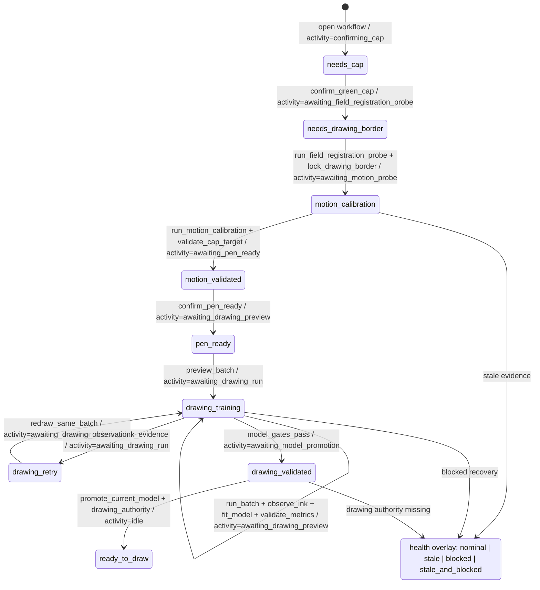

# Architecture

This document is the canonical Plotter Vision system contract. If a workflow,
authority boundary, route family, artifact freshness rule, or safety invariant
is stated elsewhere, that other document should point here instead of restating
the contract.

## Machine And Controller

- One physical two-axis pen plotter.
- Motion controller: OpenBuilds BlackBox X32 or close equivalent.
- Firmware: grblHAL-compatible.
- Implemented transport: USB serial from macOS plus mock transport for tests and
  preview workflows.
- Pen: servo-controlled; command mapping is explicit configuration, not
  auto-detected behavior.
- Homing, limits, absolute machine position, and axis trust are useful
  diagnostics but are not prerequisites for Visual Field Setup.

## Non-Goals

- No SVG import until setup, simulation, residual observation, and drawing
  correction are reliable.
- No full CAM pipeline.
- No iPad-native app.
- No closed-loop real-time vision control.
- No automatic firmware settings writes.
- No automatic homing or unlocking.
- No auto-detected servo commands.
- No opaque neural-only drawing correction or heavyweight ML runtime dependency
  in the production correction path.

## Authority Boundaries

- `plotter_vision.bridge` is the local machine-action boundary. It owns routing,
  safety validation, planning, simulation, controller access, transcripts,
  calibration artifacts, drawing sessions, model promotion, and trust decisions.
- SwiftUI is the operator surface and bridge client. It may select cameras,
  collect observations, render overlays, supervise an app-owned bridge child,
  and call typed bridge endpoints. It must not own serial transport, raw G-code
  semantics, trust promotion, or persisted model authority.
- Python owns visual-field registration, cap localization, relative motion-model
  calibration, drawing-program planning, simulation, residual solving,
  persistence, retry policy, and trust flags.
- Preview is separate from execution. Preview routes force dry-run behavior,
  return simulated/projected geometry only, never move hardware, and never write
  controller transcripts.
- Manual Machine-panel jogs may expose an explicit operator Boundary Override
  for stale projected workspace bounds. That override is not calibration trust:
  it is limited to operator-requested jog arrows and must not bypass bridge
  connectivity, live arming, max jog/feed limits, busy/alarm guards,
  pen/drawing gates, or setup validation.

## Canonical Workflow

The app-first drawing flow runs through the single **Calibrate Vision-Machine
Interface** workflow. `GET /calibration/workflow/status` is the composed
workflow authority: phase, `ready_to_draw`, ordered steps, current blocker, next
primary action, safe auto-actions, freshness ids, activity, health, stale
downstream evidence, and overlay badge state. `phase` is the progress plateau;
`activity` is the current operation or wait state; `health` carries meta-state
such as stale or blocked. Stale downstream evidence and blocked recovery
conditions are not workflow phases.

1. Start the app against an app-owned dry-run hardware-standby bridge or a
   deliberate diagnostic bridge.
2. Open **Calibrate Vision-Machine Interface**.
3. Confirm the visible green cap detection or click the green cap marker if
   detection is not usable. This first acknowledgement is persisted as Python
   workflow cap-confirmation state before Drawing Border registration; it is
   not field-localized cap evidence or motion trust.
4. Run a field registration probe before locking or drawing the Drawing
   Border. The probe first measures cap jitter, then runs a cardinal `+X`,
   `+Y`, `-X`, `-Y` minibatch to get the first empirical 2x2 machine-to-camera
   estimate. There is no identity matrix as calibration evidence; before that
   first minibatch the prior is simply no model. Every subsequent solved
   estimate becomes the current online transform, and later relative vectors
   are chosen from that latest estimate, which may prioritize the weaker
   learned basis and keep refining the matrix. The loop uses every later solved
   estimate as current online evidence. The loop reports update magnitude as
   the convergence signal. Update magnitude is the convergence signal, with
   magnitude approaching zero as the desired behavior. Swapped, rotated,
   skewed, or sign-reversed axes are normal outcomes of the learned matrix.
5. Set Drawing Border from the current 2x2 transform. The seeded border uses
   the operator-selected physical field width and height, defaulting to
   200 mm x 150 mm, as dimensions on the current video rectangle. The operator
   can type explicit X and Y millimeter values; changing either dimension sets
   only that dimension and does not infer the other from video aspect. The
   workflow must assign typed X/Y values directly. Editing X and Y sets the
   declared field dimensions without aspect-ratio inference.
   Residuals and field-corner precision remain quality diagnostics, but setup
   must not discard the current transform behind a second accepted-estimate
   gate. Every later solved estimate updates the provisional Drawing Border
   until the operator locks it. The seeded video border is operator-adjustable
   as a rectangle; the video Drawing Border remains operator-adjustable as a
   rectangle: drag the border to move it, drag the top-right handle to resize
   it while it remains rectangular, and release to re-lock border registration
   using the adjusted corners. Changing field dimensions re-locks the current
   Drawing Border instead of forcing reset and reseed.
6. Validate Motion by moving the cap to visual-field targets through the
   learned inverse model. These validation moves are setup-relative jogs and
   must not be blocked by absolute `MPos` workspace projection. This proves
   predictable green-cap motion in the user-defined field; it does not prove
   pen position, ink behavior, or drawing correction.
7. Confirm pen readiness. During setup, the cap and tip are colocated until
   explicit binding evidence proves otherwise. The pen-ready confirmation
   belongs to the current Drawing Border, camera, and field.
8. Preview, run, observe, retry, fit, validate, and promote deterministic
   `DrawingProgram` training batches through Python-owned drawing-session
   routes. Machine movement and drawing require explicit clicks. Safe
   non-motion steps may auto-run when returned by workflow status.
9. Use Face Video for portrait/image-derived drawing only after bridge preview
   and execution gates.

<!-- CALIBRATION_WORKFLOW_CONTRACT:BEGIN -->

Generated from `plotter_vision.calibration.workflow_contract`.



Allowed workflow phases:

```text
needs_cap
needs_drawing_border
motion_calibration
motion_validated
pen_ready
drawing_training
drawing_retry
drawing_validated
ready_to_draw
```

Allowed workflow activities:

```text
idle
confirming_cap
awaiting_field_registration_probe
registering_border
running_field_registration_probe
awaiting_motion_probe
running_motion_probe
awaiting_motion_observation
awaiting_pen_ready
awaiting_drawing_preview
awaiting_drawing_run
running_drawing_batch
awaiting_drawing_observation
fitting_model
validating_model
awaiting_model_promotion
awaiting_drawing_authority
running_machine_action
```

Allowed workflow health values:

```text
nominal
stale
blocked
stale_and_blocked
```

<!-- CALIBRATION_WORKFLOW_CONTRACT:END -->

Changing the Drawing Border, camera, or field dimensions sets `health: stale`
when downstream evidence no longer belongs to the current authority. Retry
exhaustion, missing drawing execution authority, or a blocked drawing session
sets `health: blocked`. The UI renders phase, activity, and health together
instead of inventing synthetic phases for stale or blocked conditions.

## Evidence Boundaries

| Step | Evidence recorded | Does not prove |
| --- | --- | --- |
| Confirm Green Cap | Python workflow cap-confirmation artifact with camera-space cap point. | Field-localized cap evidence, relative motion model, or drawing authority. |
| Field Registration Probe | Cap jitter, commanded relative machine vectors, before/after camera-space cap observations, residuals, condition number, online estimate state, corner precision, learned 2x2 machine-to-camera basis. | Cap-to-tip offset, ink binding, or drawing authority. |
| Set Drawing Border | Drawing Border corners, field registration id, border size in millimeters, reprojection error. | Pen position or drawing authority. |
| Validate Motion | Target field coordinate, inverse machine-relative move, observed cap result, residual or blocker. | Actual drawing readiness. |
| Confirm Pen Ready | Operator acknowledgement with current Drawing Border/camera/field ids. | Ink quality or model validity. |
| Drawing Training | Planned `DrawingProgram` batch, plan hash, projected preview, explicit run, observed mark residuals, retry history, fit/validation metrics, candidate `residual_grid_v1` cells and blockers. | Active correction unless the bridge has promoted a fresh ready model for the current Drawing Border and camera. |
| Setup-frame compatibility route | Cap closure residuals, expected/observed frame overlays, green frame edge/corner observations. | A primary wizard path or full drawing correction from one rectangle. |

## Drawing Pipeline

All drawing lanes pass through the same bridge-owned pipeline before real ink
motion:

```text
DrawingProgram -> Planner -> Simulator -> VideoProjector -> Preview Overlay
  -> Executor -> Vision Observer -> Residual Solver -> Persisted Binding
```

Simulation is not decorative UI. It is expected pen motion projected onto the
plotter video stream, and residual solving compares that expected geometry with
video observations of actual pen marks.

Do not add SVG import, a separate plotter-video grid, or a Swift-only
calibration drawing path. The richer calibration sheet is a `DrawingProgram`,
not an SVG file and not a separate plotter-video grid. The current sheet family
is `multi_shape_coordinate_sheet`.

## Drawing Calibration Models

Drawing calibration has two lanes:

- The setup-frame lane is backend compatibility/setup evidence only. It can
  trace the canonical Drawing Border, record expected and observed green-frame
  geometry, convert those measurements into generic drawing samples, and write
  them through drawing-calibration session persistence. It is not a visible
  wizard action, and a single frame is narrow evidence that must not promote
  broad drawing trust by itself.
- The progressive session lane is the active richer `DrawingProgram`
  calibration path. Python owns `/calibration/drawing/session/start`,
  `/status`, `/preview-next-batch`, `/run-batch`, `/observe-batch`, `/fit`,
  `/validate`, and `/finish`.

Session state and model artifacts are separate. Sessions live under
`artifacts/calibration_sessions/drawing_calibration_sessions/{session_id}.json`,
with `latest_drawing_calibration_session.json` as the current pointer. Solved
models live in `latest_drawing_calibration.json` and
`drawing_calibrations/{model_id}.json`. The latest model file is not a rolling
observation accumulator.

A session-derived model may use `model_family: residual_grid_v1` only when the
observed marks came from a planned `DrawingProgram` batch, the plan hash
matches, the evidence belongs to the current Drawing Border registration and
camera, coverage and uncertainty gates pass, validation holdout metrics are
acceptable, and retry exhaustion has not blocked the session. Action residuals
may add only bounded deterministic terms over direction, feed, segment length,
curvature, pen transition, stroke order bucket, approach direction, and repeated
opposite-direction strokes. `primitive_id` is diagnostic-only for production
action residuals.

Swift may show the current session, batch, retry count, model family, solver
kind, action model kind, residuals, validation error, blockers, and artifact
paths, but Python decides model persistence and planner authority.

## Coordinate Spaces

| Space | Owner | Purpose |
| --- | --- | --- |
| Camera image space | Swift observes; Python persists evidence | Raw points, contours, cap detections, and ink marks. |
| Visual field space | Python bridge/calibration | User-defined drawing field from camera-space Drawing Border and known physical dimensions. |
| Observed field millimeters | Python calibration/readiness | Green-cap observations and residuals in the active Drawing Border frame. |
| Drawing/logical millimeters | Python drawing/planning | DrawingProgram coordinates lowered through planner/simulator. |
| Machine coordinates | Python bridge/machine/motion | Controller coordinates behind planning and safety gates. |
| Display space | Swift | Fit/fill/rotation/FOV zoom and overlay rendering only; it is not motion authority. |

The Plotter Video has no separate grid overlay for setup. The Drawing Border is
the only setup rectangle overlay, the bottom-left border corner is logical
`(0,0)`, and that same registered border is the geometry the backend
compatibility setup-frame route may trace and evaluate.

Plotter-camera FOV zoom is persisted Swift display state for operator
inspection. It must not crop bridge geometry, promote trust, or alter
Python-owned calibration and execution authority.

## Route Families

Current public bridge surfaces are grouped by authority:

- Lifecycle and status: `GET /health`, `GET /machine/status`.
- Setup/readiness: `GET /paper/status`, `POST /paper/register`,
  `POST /calibration/pen/observe`, `POST /calibration/probe/observe`,
  `GET /calibration/workflow/status`.
- Drawing training/model visibility: `GET /calibration/drawing/status`,
  `GET /calibration/drawing/session/status`,
  `POST /calibration/drawing/session/*`,
  `POST /calibration/drawing/program-observation`.
- Drawing preview/execution: `/draw/*`, `/calibration/drawing/program/*`, and
  `/capabilities/tests/*` route families, each staying behind planner,
  simulator, safety, and execution gates.
- Machine actions: `/machine/*` typed actions for arm, reconnect, jog,
  relative move, home, center, pen, stop, resume, unlock, and related guarded
  commands.
- Agent diagnostics: `GET /codex/snapshot`, `GET /codex/events`,
  `POST /codex/app/state`, and `POST /codex/app/events`. The POST routes are
  diagnostics ingestion only, not command routes.

## Safety And Protocol Invariants

The original passive probe remains the safest first hardware contact and sends
only:

```text
$I
$G
?
$$
$#
```

It does not move the machine, unlock alarms, home axes, write settings, enter
check mode, reset the controller, or actuate the pen.

Local protocol pattern:

```text
HTTP route -> service method -> safety validator -> planner/simulator -> controller -> transport
```

Forbidden pattern:

```text
HTTP route -> serial.write(...)
```

Treat `error:` as command failure. Treat `ALARM:` as safety-critical. Timeouts
must include the command being waited on. Save transcripts even on failure. Do
not hide raw controller lines.

## Stale Concepts

- Do not restore agent-prompt directories as canonical project documentation.
- Do not restore a separate Plotter Video setup grid. The canonical setup
  rectangle is the Drawing Border.
- Do not make cap visibility, preview overlays, or confirmed cap snapshots a
  substitute for Python-owned workflow readiness.
- Do not route machine commands through `/codex/snapshot`, app diagnostics, or
  hidden app-side command channels.
- Do not reintroduce ad hoc example drawing buttons as the operator drawing
  surface. New drawing surfaces route through `DrawingProgram` preview,
  simulation, execution, observation, and residual gates.
