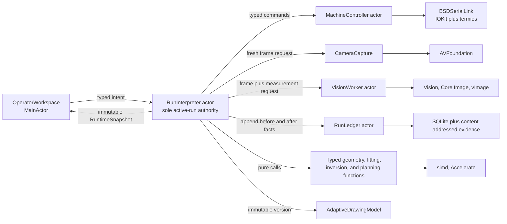
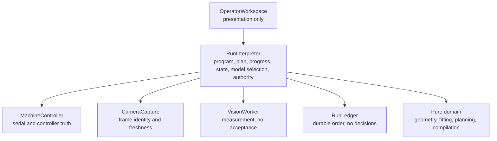
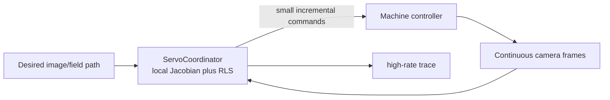
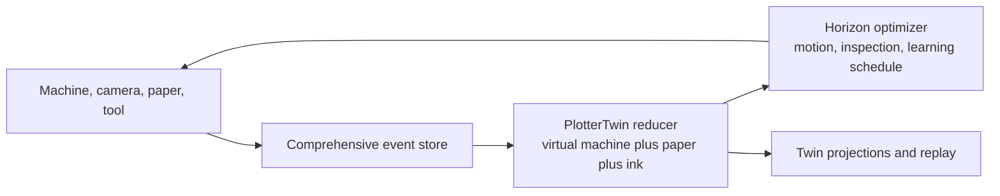
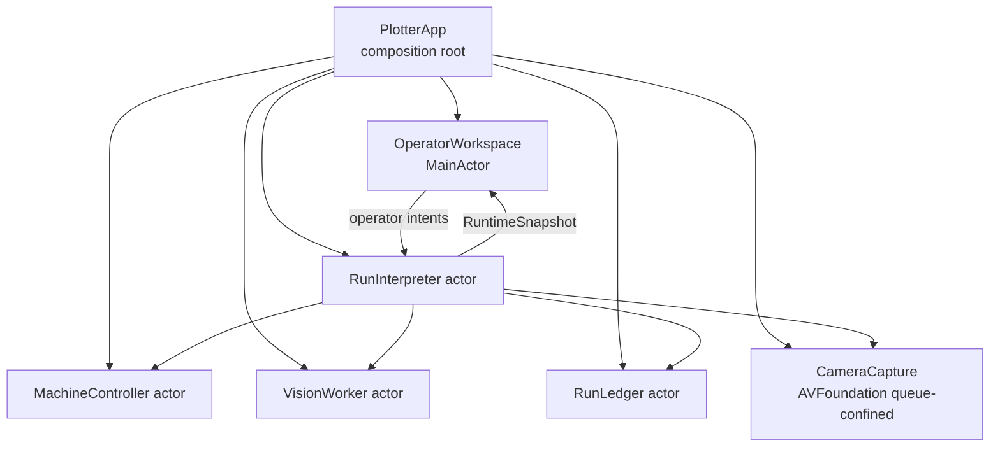
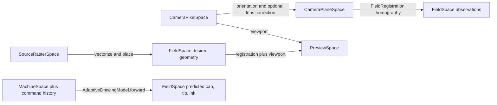

# Swift Adaptive Plotter Rewrite: Architecture Assessment and Design

Status: recommended rewrite architecture  
Assessment date: 2026-08-02  
Scope: native macOS product architecture; no implementation in this document

## Research method and decision standard

Six workstreams independently examined current-system forensics, control and estimation, geometry and numerical modeling, native Swift systems, operator observability, and execution-language design. A separate critic cohort reviewed three candidate architectures for directness, numerical coherence, and replay/recovery. The old repository and its historical artifacts were treated as evidence, not as an API or workflow specification.

The decision standard is the product's real causal loop:

```text
logical vector stroke
  -> bounded machine/pen plan
  -> execute
  -> lift and move the tool clear
  -> acquire fresh stable evidence
  -> compare intended, predicted, and observed ink
  -> correct current state where directly observed
  -> accept slow parameter changes only with sufficient evidence
  -> replan only unexecuted strokes
```

The architecture is judged by whether this loop is safe, observable, replayable, numerically identifiable, and direct to develop—not by whether it preserves existing routes, screens, names, or tests.

## 1. Executive decision and non-goals

### Decision

Build one Swift 6 macOS application process. The architecture is a **checkpointed adaptive visual-feedback drawing controller**, more precisely a **hybrid indirect adaptive controller with online geometric system identification**.

Use these names:

- Product/control concept: **Adaptive Drawing Control**.
- Learned command-to-observed-mark model: **AdaptiveDrawingModel**.
- Current run authority and interpreter: **RunInterpreter**.
- Durable ordered evidence: **RunLedger**.

Do not call the system a digital twin. NIST describes digital twins as broad, synchronized, predictive representations spanning monitoring, optimization, and lifecycle concerns. That framing adds no geometric precision here and encourages a duplicate virtual machine, system-of-systems boundaries, and speculative state synchronization. The required model is intentionally narrower: it predicts where a commanded cap or pen mark will appear, with uncertainty and applicability, and supports bounded inversion. See [NIST Digital Twins](https://www.nist.gov/digital-twins) and [NIST's essential-elements discussion](https://www.nist.gov/digital-twins/essential-elements).

This is closed-loop because observed ink changes later execution. It is not classical continuous visual servoing: camera features do not directly command instantaneous tool velocity while the pen is moving. It is not initially model-predictive control: no finite-horizon dynamic optimization problem is required merely to replan remaining geometry. These distinctions follow the control definitions in [Chaumette and Hutchinson's visual-servo tutorial](https://doi.org/10.1109/MRA.2006.250573), [Ljung's system-identification survey](https://doi.org/10.1016/j.arcontrol.2009.12.001), and [Rawlings, Mayne, and Diehl on MPC](https://sites.engineering.ucsb.edu/~jbraw/mpc/).

### Product architecture



This is not a client/server diagram. Every arrow is a direct typed Swift call or a read-only snapshot stream inside one process. There is no localhost protocol, DTO mirror, service registry, bus, or backend/frontend split.

### Non-goals for the first implementation

- No Python in camera acquisition, vision, live state, calibration, safety, machine control, planning, execution, persistence authority, or UI workflow. Python may analyze exported run bundles offline and may not write active model authority.
- No port of the current bridge, route families, wizard, readiness flags, compatibility paths, capability-test UI, or string-contract tests.
- No continuous per-frame parameter mutation and no mid-stroke model switch.
- No digital-twin aggregate, general workflow engine, plugin system, scripting language, repository-per-entity layer, or speculative protocol hierarchy.
- No portrait, broad image tool collection, SVG import, optional panel inventory, or advanced pen model before the one-stroke ink-feedback vertical slice works and replays.
- No neural correction model. It has no initial data, identifiability, extrapolation, or replay advantage.
- No claim of absolute ruler calibration. `FieldSpace` uses nominal millimetres for useful geometry and feed reasoning; observed mark agreement in the current camera-registered field is the primary success measure.
- No automatic homing, unlocking, settings writes, alarm clearing, or blind resume.

## 2. Evidence-backed current-system assessment

### 2.1 Current ownership

The current documentation declares Python as the live authority and Swift as camera/UI. The code only partially honors that split.

| Concern | Current owner and file evidence | Rewrite implication |
| --- | --- | --- |
| Camera acquisition and frame analysis | Swift `CameraModel` owns AVFoundation capture, device selection, frame retention, face raster capture, and portions of ink inspection (`macos/PlotterVision/Sources/PlotterVision/CameraModel.swift:1-120`, `:300-420`). | Retain AVFoundation techniques as reference; isolate acquisition from measurement and domain decisions. |
| UI and operator working state | `OperatorWorkspaceState` owns camera objects, windows, overlays, Drawing Border editing, motion models/samples, portrait captures, wizard state, and logs (`OperatorWorkspaceState.swift:3-44`, `:106-169`). | Redesign. UI may own only presentation state and draft intent. |
| Serial transport and controller state | Python `plotter_vision/controller/grbl.py:20-277` owns serial commands, parsing, status, stop/resume, and transcripts. | Reimplement natively in one `MachineController` actor; keep real transcript fixtures. |
| Safety and machine configuration | Python `machine/safety.py:16-237` and `config.py:18-109` own arming, workspace, feed/distance limits, travel, pen commands, and trust flags. | Preserve proven invariants, discard legacy trust flags and Python structure. |
| Logical drawing, planning, and compilation | Python `drawing/polygons.py:17-229` and `bridge/planner.py:450-792`. | Redesign as typed Swift values and pure lowering. Do not port primitive inventory wholesale. |
| Execution | Python bridge builds plans and sends controller commands (`bridge/server.py:1636-1729`, `:2090-2175`). | Rebuild as `RunInterpreter` orchestration over pure planning/compilation functions; no route boundary. |
| Workflow and model promotion | Python composes phase/activity/health, blockers, sessions, model readiness, and promotion (`bridge/server.py:6107-6323`). | Replace workflow state with direct run/evidence/authority facts. |
| Persistence | Python writes mutable latest pointers and per-object JSON artifacts (`bridge/server.py:5489-5604`, `:6001-6051`). | Replace with one ordered run ledger and immutable model versions. |
| Relative motion model | Python fits a 2x2 model in `probe_evidence.py:205-355`; Swift separately fits, stores, hydrates, updates, and uses `VisualMotionModel` (`Models.swift:685-772`, `ContentView.swift:820-875`, `:1463-1473`, `:1948-2000`). | Delete both authorities; rebuild one causal Swift model. |
| Portrait generation | Swift captures a small luminance raster and has a local contour fallback; Python has distinct contour-preview and face-raster execution routes (`ContentView.swift:508-583`, `PlotterBridgeModel.swift:1436-1580`, `server.py:2177-2355`). | Delete both live paths. Reintroduce one source-to-`DrawingProgram` converter only after closed-loop vector drawing. |
| Diagnostics | Swift records app state/events; Python merges process, machine, workflow, and artifact state into `/codex/snapshot` (`AppDiagnostics.swift:30+`, `server.py:1218-1379`). | Retain correlation/provenance semantics; remove cross-process merging. |

Structural concentration confirms that translation is the wrong strategy: `bridge/server.py` is 8,206 lines; `PlotterBridgeModel.swift` 3,966; `ContentView.swift` 3,595; `PlotterBridgeClient.swift` 1,892; and `CameraModel.swift` 1,245. The test suite currently collects 323 tests, many of which protect route names, wizard strings, and legacy surfaces rather than durable product invariants.

### 2.2 Readiness and authority meanings

The current product overloads the same words for different evidence:

| Existing fact | What it actually proves | What it does not prove |
| --- | --- | --- |
| Bridge online | Process/API/build availability. | Motion, pen, ink, or drawing authority. |
| Machine ready | Connected, idle, non-alarm, non-busy controller, subject to separate arming. | Physical position, cap location, or ink. |
| Cap confirmed | Operator accepted one camera-space marker observation. | Field localization, motion map, tip position, or drawing. |
| Drawing Border locked / paper registration | Four-corner camera-to-field planar registration. | Pen behavior or command-to-ink agreement. |
| Cap localized | Cap observation maps into the current field. | Pen-tip position or successful marking. |
| Relative motion valid | Cap displacement supports a current 2x2 motion map. | Ink binding or drawing success. |
| `VisualReadinessState.visual_ready_to_plot` | Registration, localized cap, safe-zone placement, and cap-motion model. | Ink. |
| Bridge `_visual_ready_to_plot()` | A differently defined validated ink binding. | A promoted adaptive drawing model. |
| Pen ready | Operator acknowledgement for a current session. | Contact, ink quality, or mark geometry. |
| Drawing model ready | Fresh model passing its coverage, fit, uncertainty, and holdout gates. | Authority if machine/evidence dependencies are stale. |
| Workflow `ready_to_draw` | Current cap readiness, pen acknowledgement, ready promoted session/model, and no blockers. | A permanent state; dependencies can become stale immediately. |
| Preview ready | Simulation/projected geometry. | Permission to move or mark. |

The replacement will not create a synonym table. It will expose the underlying facts and one computed `ExecutionAuthority` containing exact evidence dependencies, applicability, expiry/freshness, fixed constraints, and blockers. There is no `calibrated: Bool`.

### 2.3 Launch and portrait paths

The current live product has four ownership paths: normal app-owned ephemeral Python child, `BridgeProcessSupervisor`, launcher compatibility modes, and direct CLI/Make bridge launch. That explains existing build, source-root, PID, port, and lifecycle diagnostics; it does not justify retaining any of the paths. The Swift product will launch as one signed application with no source checkout or virtual environment dependency.

The current portrait UI ends at preview:

```text
face camera frames
  -> Swift 28x36 luminance raster
  -> Python contour preview or Swift fallback contour overlay
  -> in-memory portrait capture
```

Python's `/draw/face` uses a different raster-to-polygon execution algorithm, and no Swift caller executes it. Therefore no current portrait path should be treated as a successful product slice.

### 2.4 Historical runtime evidence and hardware constraints

Available artifacts are historical, not current live state. The newest app and bridge events inspected were from 2026-07-05; no current Plotter process or controller serial device was present on 2026-08-02. The last available live run reported:

- controller connected, live, idle, and non-alarm;
- cap-motion validation with four accepted observations, roughly 0.4 mm RMS and 0.5 mm maximum residual;
- workflow at `motion_validated/awaiting_pen_ready`, then a drawing session and batch preview;
- drawing blocked because `axis_model_trusted` was false and no validated future ink binding existed;
- no accepted binding observations and no promoted drawing-calibration model.

This is valuable proof that cap-motion success did not establish ink authority.

The artifact tree also demonstrates a storage failure mode: inspection found roughly 265,000 controller transcript files and tens of thousands of diagnostic-capture files. Raw evidence is valuable; global unindexed file proliferation is not.

Machine facts to preserve as hypotheses and reverify physically:

- OpenBuilds BlackBox X32, grblHAL-compatible firmware, USB serial at 115200.
- Two motion axes.
- Current app configuration says X travel 533.4 mm, Y travel 215.9 mm.
- Observed pen commands are `M3 S40` for up and `M3 S720` for down, with a 0.3 s settle.
- Historical pin behavior and homing/limit settings are documented in `docs/RUNBOOK.md`.
- An older controller snapshot still reported 200 mm travel settings, contradicting later application configuration. Do not choose defaults from either artifact without a passive physical verification.

### 2.5 Useful evidence to retain

- Passive GRBL interrogation and raw TX/RX preservation, including `error:`, `ALARM:`, pins, timeouts, and failed-command evidence.
- Dry-run defaults, explicit arming, bounded jog/feed/workspace validation, and separation between passive diagnostics and motion.
- Stable AVFoundation viewer, camera-role selection, frame identity, pan/zoom/overlay techniques.
- Expected-path, predicted-path, observed-ink, cap/tool, Drawing Border, and residual overlay concepts.
- Provenance fields: run, batch, plan hash, command, primitive/stroke, camera, registration, model, and observation IDs.
- Deterministic planner/simulator fixtures; continuous segment subdivision; parser and mock-controller tests.
- Ink inspection code as experimental reference, not as validated thresholds.
- Historical physical transcripts, settings observations, alarms, and limit behavior as test fixtures.

## 3. Research-grounded control and modeling formulation

### 3.1 Four authoritative information classes

| Class | Examples | Update rule |
| --- | --- | --- |
| Direct evidence | Commands, controller bytes and reports, raw frames, cap points, ink masks/curves, operator intents, timestamps. | Immutable and append-only. |
| Current run state `x` | Current alignment correction, cap/tool pose and covariance, command-queue certainty, completed prefix, frame stability/freshness. | Correct immediately only from measurements that identify the changed state. |
| Slow parameters `theta` | Affine motion map, tool offset, backlash, optional spatial spline, pen contact/mark parameters. | Create a candidate from accepted batches; promote atomically at checkpoints only. |
| Fixed safety constraints `C` | Travel, hard limits, allowed drawing/clear regions, feed/jog limits, command timeouts, maximum update, uncertainty margin. | Immutable during a run; learning cannot widen or bypass them. |

The effective planning truth is one immutable tuple:

```text
Authority_k = (state_k, stateCovariance_k,
               acceptedModelVersion_k, parameterCovariance_k,
               fixedSafetyPolicy, evidenceDependencies)
```

Controller-reported position is direct reported evidence, not independent proof of physical cap position or ink.

### 3.2 Forward model

For desired FieldSpace stroke `gamma_i(s)`, emitted MachineSpace trajectory `u_i(s)`, action context `phi_i`, fast state `x_k`, and accepted parameter version `theta_v`:

```text
predictedObservedInk_i(s) = g(theta_v, u_i(s), phi_i, x_k)
```

Decompose the causal path instead of fitting unrelated forward and inverse tables:

```text
MachineSpace trajectory
  -> affine motion map
  -> stateful direction/backlash correction
  -> optional continuous spatial residual field
  -> ToolSpace cap-to-tip offset
  -> separate pen-contact/mark model
  -> FieldSpace predicted ink
  -> FieldRegistration projection for camera overlays
```

An equivalent field prediction is:

```text
g(u, phi; x) = T(x) [ A B_beta(u_history) + b
                      + S(normalize(u))
                      + o_tip
                      + P_pen(phi) ]
```

`T(x)` is a small, fast alignment correction. `A,b` are global affine motion parameters. `B_beta` is stateful mechanical take-up. `S` is an optional smooth spatial correction. `o_tip` is the ink-validated cap-to-tip offset. `P_pen` predicts contact-specific effects and must not absorb global XY geometry.

### 3.3 Two residuals

After monotone, uncertainty-gated correspondence `pi(s)` between predicted and observed stroke geometry, record two residuals:

```text
goal residual  r_goal(s)  = observed(pi(s)) - logicalDesired(s)
model innovation r_model(s) = observed(pi(s)) - model(emittedCommand(s))
```

`r_goal` answers whether the drawing succeeded. `r_model` answers whether the accepted model predicted the emitted command and is the residual used for parameter fitting. Fitting directly against logical intent confounds planning error, command realization, and perception.

Decompose residuals into cross-track and along-track components. Cross-track error is the primary interior path-fidelity measure. Along-track error is identifiable mainly at endpoints, corners, intersections, and explicit landmarks and is particularly important for pen onset/release behavior.

Persist more than RMS:

- expected-arc coverage and missing intervals;
- cross-track RMS;
- Euclidean p95 and maximum;
- start/end displacement and tail length;
- observed width and missed-contact probability;
- extra-ink area and unexpected components;
- topology/association ambiguity;
- observation and propagated registration covariance.

Missing ink, unexpected branches, or wrong topology are categorical evidence failures, not large numeric samples to average into a fit.

### 3.4 State correction and slow learning

At a checkpoint, correct only state components identified by the observation. A single cap point can update translation but not independently establish rotation or nonlinear distortion. A long unmarked line strongly observes normal error and weakly observes tangential position.

A candidate slow model is fitted with covariance-weighted robust loss, a prior trust term, and smoothness regularization:

```text
theta_candidate = argmin_theta
    sum_j robust( r_model_j' S_j^-1 r_model_j )
  + ||theta - theta_accepted||_Lambda^2
  + lambda_s ||L theta||^2
```

Use RANSAC only to reject gross correspondence failures during registration or initial affine fitting; use Huber IRLS for accepted residuals. See [Fischler and Bolles](https://doi.org/10.1145/358669.358692) and [Huber](https://doi.org/10.1214/aoms/1177703732).

Update only the identifiable parameter subspace. Require sufficient singular values and bounded condition number for the relevant weighted design matrix; otherwise freeze unidentifiable terms. Parameter convergence depends on persistent excitation, not sample count alone; see [Bai and Sastry](https://doi.org/10.1016/0167-6911(85)90035-0).

### 3.5 Adaptation policy

Reject continuous per-frame parameter learning. Ink is not reliably observable until the pen is lifted and the region is clear; motion blur, occlusion, wet ink, and one segmentation error must not mutate later physical commands. Also reject freezing all learning for an entire long portrait; camera shift, mechanical drift, and contact changes still need bounded correction.

Adopt this dual-rate policy:

- At every explicit inspection checkpoint, accept well-observed fast state correction immediately.
- Fit slow candidate parameters only from sufficient, balanced, accepted evidence.
- Atomically accept a new immutable model version or retain the prior version.
- Initially inspect after every stroke.
- Later group only low-risk short strokes, with a maximum uninspected time/arclength and mandatory inspection before weak-coverage regions, new direction/contact regimes, long strokes, model changes, or anomalies.
- Never switch model versions mid-stroke.
- Never queue controller commands beyond the next inspection boundary.

Research on uncalibrated adaptive visual servoing demonstrates that an image Jacobian can be learned online, but that continuous operating regime is the wrong product fit for irreversible ink. It remains relevant to bounded, pen-up cap reacquisition, not drawing authority. See [Piepmeier, McMurray, and Lipkin](https://doi.org/10.1109/TRA.2003.820923).

### 3.6 Model acceptance and replanning

An observation may influence state or fitting only when run, registration, camera configuration, plan hash, command transcript, stroke, and model version match; the controller prefix is known; the frame is fresh and stable after a verified clear move; association is unambiguous; and the evidence falls inside quality gates.

A candidate model may become active only when:

- the intended parameter subset is identifiable;
- whole-stroke holdout RMS, p95, and maximum improve within declared gates;
- no field region, direction, feed, or contact regime regresses beyond tolerance;
- the forward Jacobian stays nonsingular, same-sign, and bounded across the applicable region;
- maximum model change stays within a configured trust region;
- inversion remains stable and its uncertainty envelope stays within the fixed safety boundary;
- remaining work lies inside evidence coverage and applicability.

Intra-run acceptance may guide remaining strokes without automatically promoting the model to the long-term baseline. Cross-run promotion requires repeated physical evidence.

At acceptance or state correction:

```text
remaining = program stroke IDs - resolved stroke IDs
successor plan = plan(remaining, new state, accepted model, same fixed constraints)
```

Completed, ambiguous, failed-ink, and operator-skipped strokes are never silently returned to the unexecuted set. A partial stroke is never automatically redrawn.

## 4. Candidate architectures

### Alternative A — Direct checkpointed adaptive kernel (chosen)

#### System and ownership



- Data/state ownership: one active-run authority in `RunInterpreter`; device facts remain in their lifecycle owners; UI renders immutable projections.
- Geometry: registered `FieldSpace`; one causal affine-plus-progressive `AdaptiveDrawingModel`; no independent inverse fit.
- Training: explicit pre-frame, known stroke, lift, clear, stable post-frame, residual, evidence decision, versioned candidate, holdout gate.
- Execution language: immutable `DrawingProgram`, typed `ExecutionPlan`, one bounded controller batch at a time.
- Observability: one ordered ledger, evidence/model comparison, synchronized viewport and replay.
- Failure/recovery: checkpointed pause; ambiguous physical work is inspected and adjudicated, never blindly resent.

Risks: the central engine can become another monolith; actor reentrancy can admit stale results; a rich plan enum can become a workflow framework; SQLite and evidence blobs require explicit retention design. These risks are controlled by keeping numerical work pure, device actors narrow, plan vocabulary closed, revision checks after every `await`, and the ledger decision-free.

Decision: retain and revise through critic findings. It is the only alternative aligned with when ink evidence is actually observable.

### Alternative B — Continuous image-based adaptive servo

#### System and ownership



- Data/state ownership: `ServoCoordinator` owns local image error, Jacobian estimate, command increments, and online parameter state.
- Geometry: primarily image-space/local Jacobian, optionally field-registered for overlays.
- Training: cap motion continuously excites and updates the Jacobian; ink detection attempts to validate during or immediately after motion.
- Execution language: streamed path fragments rather than explicit stroke/checkpoint blocks.
- Observability: high-rate error and Jacobian traces; live residual visualization.
- Failure/recovery: stop on frame or target loss; reacquire and resume local tracking.

Benefits: minimal global calibration, immediate cap tracking correction, and potentially good low-speed pen-up localization.

Reasons to reject for drawing:

- The pen/tool occludes the mark; wet ink and motion blur change the image; product success is not observable during the physical act.
- AVFoundation and a buffered GRBL-family controller are not a deterministic high-rate velocity-servo channel.
- Cap tracking is not ink success and cannot identify contact behavior.
- Per-frame RLS lacks persistent excitation on ordinary portrait strokes and can drift in unidentifiable directions.
- High-rate adaptation makes command/model attribution and deterministic replay much harder.
- Parameter or Jacobian changes during a long stroke can create visible discontinuities.

Decision: reject as the primary architecture. Retain a bounded pen-up cap-reacquisition technique as a later `CameraCapture`/`MachineController` interaction under fixed limits; it never grants drawing authority.

### Alternative C — Event-sourced digital twin with model-predictive planner

#### System and ownership



- Data/state ownership: a broad `PlotterTwin` reconstructs nearly all physical and inferred state from a comprehensive event stream.
- Geometry: factor graph or world model combining camera, field, machine, tool, ink, and process parameters.
- Training: all observations update the twin; the planner jointly selects drawing and future information-gathering actions.
- Execution language: higher-level goals lowered by a horizon optimizer.
- Observability: excellent historical reconstruction and what-if simulation.
- Failure/recovery: replay/reduce to last consistent state, reconcile devices, then re-optimize.

Benefits: explicit history, strong what-if analysis, and a future path to optimizing inspection cadence.

Reasons to reject for the first product:

- A twin duplicates controller, camera, and run facts behind one vague ownership term.
- Event sourcing becomes the runtime communication architecture rather than a persistence property.
- A world/factor model entangles field registration, fast state, slow geometry, and pen contact before experiments establish identifiability.
- MPC adds solver, horizon, cost-weight, feasibility, and timing failure modes without a demonstrated optimization problem.
- Broad lifecycle/state schemas and reducers inflate every new observation and capability.

Decision: reject the digital-twin and MPC framing. Retain append-only semantic run history, deterministic replay, pure simulation, and optional future inspection-schedule optimization as bounded capabilities inside Alternative A.

### 4.4 Independent critique record and primary-author response

The critic cohort did not author the proposals. Security/interface ceremony was explicitly out of scope except where local hardware safety or determinism was affected.

| Critic challenge | Affected proposal | Primary-author response | Adopted revision |
| --- | --- | --- | --- |
| The central engine could become `server.py` rewritten in Swift. | A | Accepted. Orchestration must own only active run transitions, versions, progress, decisions, and blockers. | Rename to `RunInterpreter`; move all geometry, fitting, matching, inversion, compilation, parsing, capture, measurement, and persistence to precise owners/pure functions. |
| Too many actors/protocols would create decorative borders. | A | Accepted, except Vision requires serialized non-`Sendable` resources. | Exactly four actors initially; queue-confined `CameraCapture`; only one narrow byte-link protocol justified by hardware, simulation, and replay. |
| “GeometryEngine” and “PlotterTwin” hide responsibility. | A/C | Accepted. | Delete both names. Use precise pure types such as `ResidualCalculator`, `DrawingModelFitter`, `CommandInverter`, and explicit immutable model/record values. |
| Registration, affine translation, tool offset, and spline modes are gauge-confounded. | A/C | Accepted. | Freeze independent `FieldRegistration`; anchor affine with cap evidence; fit tool offset only from paired cap/ink trials; constrain splines to zero affine content. |
| Direction offsets can be discontinuous and confuse backlash with contact behavior. | A/B | Accepted. | Use a continuous stateful play operator; keep state in execution and widths in slow parameters; keep pen/contact terms separate. |
| A 4x4 vector spline is already high complexity. | A/C | Accepted. | Insert an axis-separable pitch spline first; require at least five independent trials per free 2D coefficient plus full support/crossing/holdout evidence. Non-promotion is expected. |
| Plain Newton inversion and point-only validation are unsafe. | A/C | Accepted. | Damped trust-region inversion with continuation, analytic Jacobian, full forward check, and refusal on convergence/applicability/fold/uncertainty failure. |
| Per-pixel/frame sample counts create false confidence. | A/B/C | Accepted. | Cluster by physical trial and frame burst; nested cluster bootstrap and whole-stroke holdouts. |
| Continuous online learning is noisy, weakly excited, and unreplayable. | B | Accepted as a rejection reason. | Restrict continuous vision to freshness, transient localization, deviation detection, and pause requests; all slow learning remains checkpointed. |
| Freezing adaptation for an entire portrait ignores drift. | A/C | Accepted. | Dual-rate state/model policy with risk-based checkpoints; fast identifiable state may update at checkpoints, slow parameters remain gated/versioned. |
| “Completed” conflates command send, controller completion, and ink success. | All | Accepted with terminology correction: controller status is not independent physical proof. | Track `commanded`, `controllerCompleted`, `inkVerified`, and explicit ambiguity; UI labels them literally. |
| A long `DrawPath` can exceed the cancellation/ambiguity budget even with one-instruction buffering. | A/B/C | Accepted. | Subdivide into bounded controller commit blocks while keeping one model version and continuous geometry across the pen-down stroke. Derive block limits experimentally. |
| The original plan enum was becoming a workflow language. | A/C | Accepted. | Persist only finite physical/observation instructions ending at a checkpoint. Evidence/model/replan decisions are atomic runtime transactions that create successor plans. |
| SQLite/content addressing alone does not guarantee replay. | A/C | Accepted. | Define recorded-decision replay and non-authoritative algorithm re-evaluation; retain normalized measurements as well as raw frames and algorithm metadata. |
| Event sourcing can become runtime communication and duplicate state. | C | Accepted as rejection reason. | `RunLedger` is historical evidence only; live actors own current state; events never form a bus. |
| UI snapshots can recreate readiness and hide recovery truth. | All | Accepted. | Runtime supplies one `ExecutionAuthority`, exact blockers, permitted intents, and frontiers; UI owns presentation only. |
| Content-addressed storage still grows without policy. | A/C | Accepted. | Quota checks before runs, evidence retention classes, manifest-visible tombstones, no silent deletion, and active/recoverable evidence protection. |
| Old marker, color, homography, travel, pen, and homing assumptions remain unproven. | A | Accepted after forensic audit. | Treat them as explicit experiments/configuration, not defaults. Cap/marker remains optional and never grants ink authority. |

No primary architect defended continuous drawing adaptation or the digital-twin/MPC framing after critique. Their retained pieces—pen-up localization, semantic run history, pure simulation, and future bounded scheduling—were folded into Alternative A without their rejected authority structures.

## 5. Final chosen architecture and rationale

Choose Alternative A with these non-negotiable revisions:

1. `RunInterpreter` is the sole active-run authority but not a bag of algorithms. It owns versions, progress, decisions, and orchestration; pure geometry, fitting, compilation, capture, parsing, measurement, and persistence remain outside it.
2. Device boundaries exist because serial and camera lifecycles have unique invariants. Vision is separate from camera capture because a measurement must name an exact frame and be replayable.
3. `RunLedger` owns durable order and transactions but never determines readiness, accepts evidence, or promotes a model.
4. `OperatorWorkspace` owns viewport/selection/preferences only. It receives allowed intents and exact blockers; it never reconstructs authority.
5. `AdaptiveDrawingModel` is immutable and narrow. Fast run state is not stored inside it. Pen-contact parameters are a separate submodel and cannot absorb global XY warp.
6. Model changes occur only at explicit inspection checkpoints. Command buffering never crosses a checkpoint.
7. `DrawingProgram` never loses completed strokes. Progress and plan revisions are separate immutable facts.
8. Historical evidence is not reinterpreted in place. Re-analysis creates an explicitly non-authoritative analysis fork.

This architecture is extensible through data and pure functions, not prebuilt plugin borders:

- A new observation type implements a new measurement request/result and evidence policy case without changing device ownership.
- A new drawing source is a pure converter to `DrawingProgram`.
- A new overlay is a projection of recorded/domain facts.
- A new pen capability adds a typed pen profile and compiler support; raw servo commands remain device configuration.
- A new execution strategy produces another `ExecutionPlan` revision; the interpreter, ledger, and safety invariants remain the same.

## 6. Module and object hierarchy

### 6.1 Build targets

Use three product targets and one test-support target:

```text
PlotterModel      Pure values and deterministic numerical/planning code
PlotterRuntime    Device edges, run interpreter, measurements, ledger
PlotterApp        SwiftUI views and one composition root
PlotterTestSupport (test-only simulators, clocks, frame and transcript fixtures)
```

These boundaries exist for dependency and test reasons, not to simulate processes:

- `PlotterModel` has no SwiftUI, AVFoundation, IOKit, serial, or persistence dependency and can be tested deterministically.
- `PlotterRuntime` contains the four justified synchronization actors plus a queue-confined capture class.
- `PlotterApp` contains no safety, fitting, calibration, planning, or execution decisions.
- All calls are direct. There is no networking or general event bus.

### 6.2 Runtime ownership



Exactly four initial actors are justified:

1. `RunInterpreter`: serializes active-run transitions.
2. `MachineController`: serializes hardware commands and controller state.
3. `VisionWorker`: isolates reusable non-`Sendable` Core Image/Vision resources; its API is otherwise function-like.
4. `RunLedger`: serializes SQLite transactions and artifact references.

`CameraCapture` follows AVFoundation's required serial queue discipline and publishes immutable stamped frames. Actors are synchronization mechanisms, not module-decoration. Do not create planner, geometry, fitter, compiler, camera-manager, safety-manager, or model actors.

### 6.3 Object contracts

| Object | Authoritative data | Inputs and outputs | Forbidden ownership | Concurrency | Persistence and replay | Boundary/test reason |
| --- | --- | --- | --- | --- | --- | --- |
| `DrawingProgram` | Immutable logical strokes, stable IDs, styles, placement, source provenance, content hash. | Source converter -> `DrawingProgram`; planner consumes it. | Machine points, camera pixels, progress, model, commands, UI. | `Sendable` value. | Stored verbatim in each run. | Intent must survive replanning unchanged; golden encoding and geometry tests. |
| `FieldRegistration` | One camera-plane-to-Field homography, registration ID, evidence, covariance, applicability. | Independent field references -> transform; maps exact observations. | Machine correction, cap-tip offset, pen behavior, run progress. | Immutable value. | Every observation/model records its ID. | Different evidence/lifecycle from drawing correction; registration tests. |
| `AdaptiveDrawingModel` | Accepted immutable slow geometry parameters, covariance, evidence coverage, validation metrics, applicability, parent ID. | Machine path and context -> predicted cap/tip/ink path; inverse planner consumes it. | Fast state, run orchestration, model promotion, UI labels. | `Sendable` value. | Accepted and rejected versions retained. | Slow learned parameters need versioning, holdout, continuity, and inversion tests. |
| `ModelCandidate` | Fitted but non-authoritative parameters and validation report. | Accepted evidence set -> candidate. | Active-model pointer or command authority. | `Sendable` value. | Always recorded, accepted or rejected. | Prevents ambiguous “current model” during fitting. |
| `PenMarkModel` | Contact/onset/release/width/missed-mark parameters and applicability. | Tip trajectory and pen context -> mark distribution. | Global field registration or XY spatial warp. | Immutable submodel. | Versioned with the accepted drawing model. | Pen contact has distinct experiments, error measures, and invalidation. |
| `CoordinateTransforms`, `PathSampler`, `InkPathMatcher`, `ResidualCalculator`, `DrawingModelFitter`, `CommandInverter`, `PlanCompiler` | No mutable data. | Explicit immutable values -> deterministic result or typed blocker. | Runtime state, devices, persistence, UI. | Pure functions/values. | Record algorithm revision and all inputs/results. | Precise names prevent a vague `GeometryEngine`; property/golden tests. |
| `ExecutionPlan` | One finite, currently authorized instruction segment with pinned program/model/state/safety/config/compiler versions. | `PlanCompiler` -> plan; `RunInterpreter` interprets it. | Live device state, latent future branches, model mutation, UI state. | Immutable `Sendable` value. | Every accepted revision retained with parent and hash. | Separates intent from physical sequencing without becoming a workflow language. |
| `TrainingTrial` | Probe stroke, reserved region, baseline/stability/evidence policies, parent model. | Compiles through the normal planner into finite plan revisions. | Runner, device state, authority mutation. | Immutable value. | Trial definition, evidence, decision, and versions retained. | Training must use the same interpreter and ledger as drawings. |
| `MachineController` | Connection, controller-reported state, pins, alarms/hold, outstanding command, command lifecycle, runtime arming, fixed machine safety enforcement. | Typed controller operations -> acknowledgements and `MachineSnapshot`. | Drawing semantics, camera facts, model applicability, progress, UI. | Actor. | Every TX/RX byte and parsed transition recorded. | Serial determinism/safety; real transcripts, pseudo-terminal, simulated-GRBL tests. |
| `BSDSerialLink` / `MachineLink` | File descriptor and byte I/O only. | Open/close/read/write. | GRBL parsing, safety, retries, command meaning. | Isolated by `MachineController`. | Raw bytes recorded by controller. | One narrow protocol is justified by BSD hardware, simulator, and transcript replay. |
| `CameraCapture` | Capture configuration, device identity, frame sequence/timestamps, interruption state, newest retained frame. | Bounded `frame(newerThan:)` and immutable `AsyncStream<StampedFrame>`. | Cap/ink meaning, model state, execution permission, display transform. | AVFoundation serial queue. | Record exact decision frames and capture metadata. | Capture lifecycle differs from analysis; recorded-frame and interruption tests. |
| `VisionWorker` | Reusable `CIContext`, request resources, scratch buffers only. | Exact frame plus `MeasurementRequest` -> typed measurement, quality, diagnostic products. | Latest-frame choice, evidence acceptance, model promotion, run phase. | Actor only because resources require serialization. | Frame/request/algorithm/result and hashes recorded. | Vision evolves and replays independently; golden image corpus. |
| `RunInterpreter` | Active run ID; accepted plan revision; instruction cursor; execution frontiers; remaining/ambiguous stroke sets; active state estimate; selected model ID; blockers; decision ID. | Operator intents and dependency results -> state transition and `RuntimeSnapshot`. | Camera/controller mirrors, numerical algorithms, history files, UI presentation. | Actor with one structured run task. | Every transition appended; live authority remains in the actor. | Necessary orchestration boundary; full simulated-run and crash-boundary tests. |
| `RunLedger` | Durable sequence, SQLite schema/transactions, immutable artifacts and hashes. | Append facts and transaction groups; export/read replay. | Readiness, evidence meaning, model selection, live device state. | Single-writer actor. | It is the historical authority. | Crash consistency and replay have distinct invariants; migration/atomicity tests. |
| `OperatorWorkspace` | Viewport, pane state, layer visibility, selection, draft input. | Immutable `RuntimeSnapshot` -> views; typed operator intents -> interpreter. | Machine/calibration/execution truth, evidence acceptance, model parameters. | `@MainActor @Observable`. | UI preferences only. | SwiftUI lifecycle differs from machine lifecycle; UI and accessibility tests. |

The `RunInterpreter` source should remain reviewable as a state transition machine. If behavior cannot be expressed as a plan transition, pure policy, or direct dependency call, move the behavior to its true owner rather than adding another coordinator.

### 6.4 Native technology decisions

- SwiftUI plus Observation for the operator shell; runtime facts arrive as immutable values. [Apple SwiftUI model data](https://developer.apple.com/documentation/swiftui/model-data)
- AVFoundation `AVCaptureSession`, `AVCaptureVideoDataOutput`, and preview layer. Evidence acquisition requires a frame newer than motion completion and measured stability; late preview frames are dropped. [AVCaptureVideoDataOutput](https://developer.apple.com/documentation/avfoundation/avcapturevideodataoutput)
- Stable `VNDetectContoursRequest` as one observation primitive, not an oracle. [Vision contour request](https://developer.apple.com/documentation/vision/vndetectcontoursrequest)
- Reused `CIContext`; vImage for morphology/distance operations; `simd` for typed small vectors/matrices; Accelerate BLAS/LAPACK for robust solves and covariance. [Accelerate](https://developer.apple.com/documentation/accelerate)
- IOKit for serial-device discovery and BSD `/dev/cu.*` with `termios`, `read`, and `write` for transport. [IOService discovery](https://developer.apple.com/documentation/iokit/1514494-ioservicegetmatchingservices), [IOKit serial family](https://developer.apple.com/library/archive/documentation/DeviceDrivers/Conceptual/IOKitFundamentals/Families_Ref/Families_Ref.html)
- SQLite as the explicit transactional run store; SwiftData is not execution authority. [SQLite application file format](https://www.sqlite.org/appfileformat.html)
- `Logger` and `OSSignposter` for supplemental live diagnostics and timing, never as the replay ledger. [Apple logging](https://developer.apple.com/documentation/os/logging)
- Swift 6 strict concurrency. The local assessment machine has Swift 6.1.2 and macOS 15.7.7 but only Command Line Tools, so the implementation team must verify the final Xcode/deployment/signing matrix before phase 2.
- Initial deployment assumption: macOS 14, because that is the current app baseline; revise only from the actual operator-Mac inventory.

Swift task cancellation is cooperative and is not a machine stop. `pauseNow()` sends GRBL feed hold `!` through the same controller authority and verifies a hold state; orderly pause stops future enqueueing; abort records abandonment and requires recovery; Ctrl-X is a controller reset, not an emergency stop; a real E-stop is physical hardware. See [Swift Task cancellation](https://developer.apple.com/documentation/swift/task/).

## 7. Typed geometry model and transform graph

### 7.1 Coordinate spaces

| Space | Definition and units | Authority rule |
| --- | --- | --- |
| `SourceRasterSpace` | Pixels of an imported/captured source, origin top-left, y-down. | Exists only until vectorization/placement. Never calibrates motion. |
| `CameraPixelSpace` | Canonically oriented native frame pixels, origin top-left, y-down, bound to camera format/configuration. | Raw observation evidence. |
| `CameraPlaneSpace` | Continuous coordinates after validated orientation and optional lens correction. | Input to planar registration. |
| `FieldSpace` | Drawing Border plane, origin bottom-left, x-right, y-up, nominal millimetres. | Canonical logical drawing, residual, and operator measurement space. |
| `MachineSpace` | Controller XY coordinates in nominal machine millimetres. | Reachability and command generation. |
| `ToolSpace` | Carriage-attached cap and pen offsets for a named tool configuration. | Fixed tool geometry evidence, not global position state. |
| `PreviewSpace` | SwiftUI points after fit, pan, zoom, and display rotation. | UI only; no path to machine authority. |

Observed ink is not another coordinate space. It is an `ObservedCurve<FieldSpace>` with frame, registration, covariance, association, and algorithm provenance.

```swift
enum SourceRasterSpace {}
enum CameraPixelSpace {}
enum CameraPlaneSpace {}
enum FieldSpace {}
enum MachineSpace {}
enum ToolSpace {}
enum PreviewSpace {}

struct Point2<Space>: Codable, Sendable {
    var x: Double
    var y: Double
}

struct VectorPath<Space>: Codable, Sendable {
    var elements: [PathElement<Space>]
}

struct MeasuredPoint2<Space>: Codable, Sendable {
    let value: Point2<Space>
    let covariance: Matrix2x2
    let frameID: FrameID
    let registrationID: FieldRegistrationID?
}
```

Runtime identity such as camera configuration and registration ID is stored in the transform/value, not pretended to be a compile-time generic.

### 7.2 Transform graph



There is no `FieldSpace -> PreviewSpace -> MachineSpace` path.

### 7.3 Registration gauge

`FieldRegistration` owns the projective transform:

```text
fieldPoint = project(H_fieldFromCamera * homogeneous(cameraPlanePoint))
```

Use a homography because planar perspective is projective. Estimate it from independent field references and freeze it for an estimation interval. If registration drift exceeds its applicability, pause and reacquire or create a new registration. Never co-fit registration, machine affine geometry, and pen offset from undifferentiated ink evidence.

The gauge is fixed by provenance:

1. `H_fieldFromCamera` comes only from field-registration evidence.
2. Affine `A,b` comes only from distributed cap-centre observations; `b` means cap centre at machine origin in the registered field.
3. Cap-to-tip offset comes only from paired cap/ink evidence after registration and affine terms are fixed.
4. Spline components have zero constant and linear moments and cannot re-identify affine terms.
5. Generic portrait ink may validate or propose a bounded residual component; it cannot jointly move registration, affine intercept, and tool offset.

### 7.4 Progressive forward model

Let `m_k` be commanded MachineSpace position and `q_k` effective mechanical position. Begin with a stateful, continuous per-axis play operator:

```text
q_axis,k = clamp(q_axis,k-1,
                 m_axis,k - backlash_axis/2,
                 m_axis,k + backlash_axis/2)
```

This represents reversal take-up without a discontinuous sign-of-velocity lookup. Backlash state comes from serialized command history. Unknown state after reset, reconnect, manual motion, or ambiguous commands blocks execution until a bounded pen-up take-up move or fresh cap observation establishes it.

The cap prediction is:

```text
capField(m_0...k) = A * q_k + b + S(normalize(q_k))
```

For fixed carriage orientation:

```text
tipField = capField + A * toolRotation * capToTipOffset
predictedInk = PenMarkModel(tipTrajectory, feed, direction,
                            penState, contactHistory)
```

Progressive families:

1. Global affine `A` (four parameters) and `b` (two), anchored by cap evidence.
2. Stateful axis backlash widths `beta_x`, `beta_y`.
3. Constant two-parameter cap-to-tip offset, ink-validated.
4. Optional axis-separable cubic pitch correction `Sx(qx), Sy(qy)` with zero constant/linear moments; four effective nonlinear degrees of freedom total.
5. Only with unusually strong two-dimensional evidence, a clamped 4x4 bicubic vector displacement field: 32 raw and 26 effective coefficients after affine-nullspace constraints.
6. Separate `PenMarkModel` for onset/release, width, missed contact, and tightly bounded contact-specific bias.

Reject a projective machine map, bilinear grid, piecewise-affine mesh, general TPS/RBF production model, and neural model. Bilinear and piecewise-affine derivatives change at cell boundaries; a long compensated line can kink. TPS/RBF global support makes local evidence alter the whole field and complicates bounded extrapolation. A bicubic B-spline is retained only because it supplies analytic derivatives, compact support, and `C2` continuity; see [Lee, Wolberg, and Shin](https://doi.org/10.1109/2945.620490). Thin-plate splines remain an offline comparison; see [Bookstein](https://doi.org/10.1109/34.24792).

### 7.5 Identifiability and trials

| Quantity | Identifying evidence |
| --- | --- |
| Lens correction | Independent target across the camera field, only if homography residuals demonstrate radial structure. |
| Field homography | Independent known Field-to-camera references spanning the border. |
| Affine `A,b` | Distributed non-collinear cap poses and independent X/Y excitation. |
| Backlash widths/state | Repeated arrival at the same targets from both directions in multiple field regions. |
| Cap-to-tip | Paired cap and isolated ink evidence with fixed registration/affine model. |
| Axis pitch spline | Clustered residual structure varying primarily by its own axis after affine/backlash/offset. |
| 2D spline | Spatially balanced ink residuals with cross-axis structure, full support coverage, crossing trials, and whole-stroke holdouts. |
| Pen model | Isolated strokes spanning feed, direction, and explicit pen transitions. |

Use a 3x3 inset cap lattice approached from both axis directions; distributed isolated crosses/dots for offset; opposing horizontal/vertical stroke pairs in at least three bands; long horizontal, vertical, and diagonal continuity trials; and whole-stroke holdouts at boundary, diagonal, curve, direction, and time groups. Samples from one stroke or frame burst are one cluster, not hundreds of independent experiments.

### 7.6 Robust fitting, complexity promotion, and uncertainty

Fit affine, backlash, offset, optional spatial residual, and pen terms in that order, then refit only jointly identifiable subsets. Use covariance-weighted Huber IRLS. Bootstrap whole trials and then frame bursts; do not bootstrap pixels as independent samples. Propagate registration covariance and empirical clustered parameter variation.

Complexity is promoted only when:

- the simpler model's grouped holdout residual shows stable structured error above repeatability noise;
- the candidate parameter subspace is well-conditioned and covered;
- clustered improvement exceeds both bootstrap error and a physical repeatability bound;
- no holdout region consumes the error budget or regresses beyond its repeatability allowance;
- displacement, gradient, curvature, Jacobian determinant, singular values, and correction magnitude remain bounded over the full applicable region.

For the 4x4 vector field require at least five effective independent trials per free coefficient, at least two independent crossing strokes through every basis-support region, boundary evidence, and full-field diagonal/curve holdouts. Non-promotion is the expected valid result unless evidence is exceptional.

Thresholds derive from recorded cap repeatability, ink-centreline repeatability, observed ink width, declared drawing tolerance, and a reserved inverse-error budget. They are not inherited magic millimetre or percentage constants.

### 7.7 Inversion and command generation

Do not fit an independent inverse. Use affine-seeded damped Gauss-Newton or Levenberg-Marquardt with a trust region and continuation along desired arclength:

1. Solve the stroke start from the affine inverse.
2. Advance a bounded FieldSpace arclength.
3. Warm-start from the previous machine solution.
4. Propagate backlash state.
5. Shrink step/trust region when conditioning worsens.
6. Forward-evaluate every accepted point through the complete model.
7. Adaptively subdivide until transformed chord error is within the inverse budget.

Reject rather than clamp when convergence, uniqueness, applicability, workspace, correction, Jacobian, or forward-error checks fail. Sample the accepted model across the complete Drawing Border and require no fold/cusp, one determinant sign, bounded singular values/condition number, and bounded curvature.

A logical pen-down stroke keeps one model version. It compiles to bounded physical commit blocks derived from measured transport/hold latency, controller buffer depth, stopping distance, safety margin, and maximum unobserved time. Commit boundaries do not permit model change and must preserve continuous path geometry.

## 8. State estimation and parameter learning

### 8.1 Three execution frontiers and uncertainty

```swift
struct ExecutionFrontiers: Codable, Sendable {
    var commanded: ProgramCursor
    var controllerCompleted: ProgramCursor
    var inkVerified: ProgramCursor
    var ambiguous: Set<StrokeSliceID>
}
```

- `commanded`: bytes have been durably recorded and written. This work cannot be freely replanned.
- `controllerCompleted`: controller evidence reports the required terminal state with acceptable pins/alarm status. Without independent encoders this is not proof of physical trajectory, so the UI must not call it “physically verified.”
- `inkVerified`: cleared-camera inspection accepted the expected mark association.
- `ambiguous`: command outcome, partial path, or ink result is unresolved. It is neither unexecuted nor safe to redraw.

Only work strictly beyond `commanded` can be freely replanned. `controllerCompleted > inkVerified` means inspection is required. `commanded > controllerCompleted` is a recovery blocker.

### 8.2 Fast state versus model versions

`RunAlignmentState` may estimate a small current translation/rotation and covariance for overlays and next-path planning. Cap or unambiguous ink anchors can update the components they identify. If correction exceeds registration applicability, pause for explicit registration reacquisition; do not absorb it into slow geometry.

Slow parameter updates follow:

```text
accepted evidence set
  -> pure fit
  -> ModelCandidate
  -> identifiability, holdout, continuity, uncertainty,
     applicability, trust-region, and inverse checks
  -> atomic accept new ModelVersion or retain prior version
```

Intra-run accepted versions affect only future uncommanded work. Cross-run baseline promotion requires repeated physical trials, stable configuration identities, and an explicit promotion decision.

### 8.3 Applicability and execution authority

```swift
struct ModelApplicability: Codable, Sendable {
    let modelID: ModelID
    let allowed: Bool
    let predictiveBound: Double
    let correctionMagnitude: Double
    let fieldRegistrationID: FieldRegistrationID
    let cameraConfigurationID: CameraConfigurationID
    let machineConfigurationID: MachineConfigurationID
    let toolID: ToolID
    let penProfileID: PenProfileID
    let representedRegimes: RegimeCoverage
    let blockers: [ApplicabilityBlocker]
}

struct ExecutionAuthority: Codable, Sendable {
    let allowed: Bool
    let operation: AuthorizedOperation?
    let planID: PlanID?
    let modelID: ModelID?
    let stateEstimateID: StateEstimateID?
    let fixedSafetyPolicyID: SafetyPolicyID
    let evidence: [EvidenceID]
    let limits: AuthorityLimits
    let blockers: [RunBlocker]
}
```

Authority is computed once by `RunInterpreter` from named authoritative snapshots and supplied to the UI. It is not an independently persisted readiness flag and SwiftUI never reconstructs it.

## 9. Training-trial lifecycle

### 9.1 First-class atom

```mermaid
stateDiagram-v2
    [*] --> Prepare
    Prepare --> Baseline: fresh stable frame; reserved region clear
    Baseline --> Draw: authority and command basis committed
    Draw --> Lift: known probe stroke completed by controller
    Lift --> Clear: pen-up requested
    Clear --> Stabilize: tool envelope clear of ROI
    Stabilize --> Inspect: consecutive fresh stable frames
    Inspect --> Evaluate: incremental ink and correspondence measured
    Evaluate --> AcceptState: reliable state evidence
    Evaluate --> FitCandidate: sufficient identifiable parameter evidence
    Evaluate --> Reacquire: weak frame or segmentation; no redraw
    Evaluate --> Paused: categorical mismatch or unsafe ambiguity
    FitCandidate --> AcceptModel: all validation gates pass
    FitCandidate --> RetainModel: insufficient or regressed validation
    AcceptState --> Checkpoint
    AcceptModel --> Checkpoint
    RetainModel --> Checkpoint
    Reacquire --> Stabilize: bounded attempts remain
    Checkpoint --> [*]
```



The atom is:

```text
prepare
  -> acquire and record clean baseline
  -> travel to known start
  -> draw one known probe under pinned authority
  -> lift
  -> clear the complete tool envelope from the observation region
  -> obtain fresh stable post-draw evidence
  -> isolate new ink from baseline/post frames
  -> match expected and observed paths
  -> compute goal residual, model innovation, coverage, topology, covariance
  -> accept or reject the observation with reasons
  -> correct identifiable fast state immediately
  -> fit/promote a slow model only if its dataset and holdouts suffice
  -> commit the exact outcome
```

Rejecting a camera observation does not authorize redrawing the same location. Reacquire frames first. A redraw needs a new reserved probe region or an explicit recorded recovery decision because existing ink corrupts both the output and the evidence.

### 9.2 Evidence acceptance

Every accepted or rejected observation records:

- run/trial/stroke/slice IDs;
- program, plan, model, state, safety, compiler, and policy versions;
- machine command IDs, bytes, acknowledgements, controller terminal state;
- baseline/post frame IDs, camera configuration, timestamps, hashes;
- FieldRegistration ID and covariance;
- predicted path, observed mask/centreline, correspondence, residual components;
- coverage, topology, ambiguity, quality, and applicability;
- accept/reject reason and which facts may be updated.

An accepted observation may enlarge the evidence dataset while the prior model remains active. Evidence acceptance and model promotion are separate facts.

## 10. DrawingProgram, ExecutionPlan, and machine compilation

### 10.1 Layer 1 — `DrawingProgram`

```swift
struct DrawingProgram: Codable, Sendable {
    let id: ProgramID
    let schemaVersion: UInt16
    let fieldExtent: Size2<FieldSpace>
    let strokes: [LogicalStroke]
    let source: DrawingSourceProvenance
    let contentHash: Digest
}

struct LogicalStroke: Codable, Sendable {
    let id: StrokeID
    let path: VectorPath<FieldSpace>
    let style: StrokeStyle
    let semanticRole: SemanticRole
    let ordering: StrokeOrdering
}
```

The first implementation supports polylines. Cubics appear only after deterministic flattening and tolerance tests. The program contains no machine points, camera data, progress, calibration flags, model parameters, controller strings, or UI state. It is never mutated to remove completed strokes.

### 10.2 Layer 2 — finite `ExecutionPlan` revisions

```swift
struct ExecutionPlan: Codable, Sendable {
    let id: PlanID
    let revision: UInt32
    let parent: PlanID?
    let programID: ProgramID
    let programHash: Digest
    let modelID: ModelID
    let stateEstimateID: StateEstimateID
    let fieldRegistrationID: FieldRegistrationID
    let safetyPolicyID: SafetyPolicyID
    let machineConfigurationID: MachineConfigurationID
    let compilerVersion: CompilerVersion
    let instructions: [ExecutionInstruction]
    let contentHash: Digest
}

enum ExecutionInstruction: Codable, Sendable {
    case liftPen(PenLiftRequest)
    case travel(MotionPath)
    case draw(DrawPath)
    case clearObservationRegion(ClearancePath, ObservationRegion)
    case awaitControllerIdle(Deadline)
    case acquireStableFrame(StableFrameRequirement)
    case inspect(InspectionRequest)
    case checkpoint(CheckpointID)
}
```

This is a closed vocabulary, not a script. It has no arbitrary variables, strings, closures, user predicates, unbounded loops, or generic workflow calls.

Safety checks occur before each effect through current authoritative snapshots; `AbortIfUnsafe` is not a plan command. Hold, abort, reset, alarm recovery, and manual recovery are out-of-band controller/runtime operations and remain ledgered.

`AcceptEvidence`, `UpdateModel`, and `ReplanRemaining` are deliberately not authored instructions. A plan ends at a checkpoint. The interpreter commits a typed `CheckpointDecision`, which may accept/reject evidence, update fast state, accept/retain a model, pause/reacquire, and request a successor plan for the remaining uncommanded work. This keeps decision authority out of a speculative script while preserving typed adaptive branching across plan revisions.

```swift
enum CheckpointDecision: Codable, Sendable {
    case acceptState(EvidenceID, StateEstimateID)
    case acceptModel(EvidenceID, ModelCandidateID, ModelID)
    case retainModel(EvidenceID, ModelID, reasons: [DecisionReason])
    case reacquire(EvidenceID, boundedAttempt: Int, reasons: [DecisionReason])
    case pause(EvidenceID?, blockers: [RunBlocker])
    case complete
}
```

The observation disposition, residual decision, candidate/retained model, advanced frontiers, and next planning basis are one atomic ledger transaction.

### 10.3 Layer 3 — controller command stream

```swift
struct ControllerCommandBatch: Codable, Sendable {
    let id: CommandBatchID
    let planID: PlanID
    let instructionIndex: Int
    let motionBlockID: MotionBlockID?
    let modelID: ModelID
    let preconditionDigest: Digest
    let commands: [ControllerCommand]
    let contentHash: Digest
}

struct ControllerCommand: Codable, Sendable {
    let id: ControllerCommandID
    let wirePayload: Data
    let acknowledgement: AcknowledgementRequirement
    let expectedEffect: ExpectedControllerEffect
    let sourceStrokeID: StrokeID?
    let sourceRange: PathRange?
}
```

Only this layer contains GRBL/serial semantics. Each batch sets required modal state explicitly instead of relying on inherited modes. `ok` means accepted by the controller, not motion-complete; completion requires the required terminal status, acceptable pins, and no alarm.

The command horizon is one bounded `MotionBlock`, never beyond a checkpoint. A logical long stroke retains one model version and may keep the pen down across curvature-preserving continuation blocks, but each block has a bounded predicted time/distance and controller commit point. Initial commit length must be established experimentally because frequent idle points may create dwell artifacts.

Command lifecycle:

```text
commit commandPrepared
  -> re-evaluate hardware guards
  -> write bytes
  -> commit commandWritten
  -> record raw response and acknowledgement
  -> wait for required controller terminal state
  -> commit controllerCompleted frontier or mark outcome ambiguous
```

No SQLite transaction spans an `await` or physical motion.

## 11. Operator observability and debugging specification

### 11.1 One Operator Workspace

Replace the fixed wizard and detached panel collection with one state-driven workspace. Evidence can become stale, fail selectively, or be reacquired during a run; a completed wizard step incorrectly implies durable truth.

```text
┌─────────────────────────────────────────────────────────────────────────┐
│ AUTHORITY: ALLOWED / PAUSING / PAUSED / BLOCKED   reason   Hold Now    │
│ plan/model/checkpoint · camera age · commanded/controller/ink progress  │
├──────────────┬─────────────────────────────────────┬────────────────────┤
│ Run          │ Live or Replay Camera Canvas        │ Inspector          │
│ navigator    │                                     │                    │
│ Program      │ logical unexecuted path              │ Authority          │
│ Plan revs    │ predicted ink                        │ Evidence           │
│ Checkpoints  │ observed ink                         │ Model              │
│ Trials       │ residual vectors                     │ Trials             │
│ Runs         │ cap and estimated tip                │ Recovery           │
├──────────────┴─────────────────────────────────────┴────────────────────┤
│ semantic timeline: command · frame · observation · decision · model    │
└─────────────────────────────────────────────────────────────────────────┘
```

Navigator and inspector may collapse. A secondary Developer Diagnostics window is allowed. Authority, controller state, pen uncertainty, and immediate hold controls are never secondary-window-only.

The `OperatorWorkspace` is not a god view model. It composes bounded, read-only projections created by pure projectors:

```swift
struct WorkspaceProjection: Sendable {
    let authority: AuthorityProjection
    let execution: ExecutionProjection
    let evidence: EvidenceProjection
    let model: ModelProjection
    let canvas: CanvasProjection
    let recovery: RecoveryProjection
    let storage: StorageProjection
}
```

It owns only selection, pane visibility, pan/zoom, layer visibility, and draft input.

### 11.2 Canvas and overlay grammar

Direct interactions:

- cursor-centered trackpad/wheel zoom;
- two-finger pan and Space-drag fallback;
- double-click Fit Drawing Border;
- Command-0 for full camera;
- FieldSpace coordinate readout; CameraPixel values only in developer mode;
- pan/zoom changes `PreviewSpace` only and never measurement or applicability.

| Meaning | Default rendering |
| --- | --- |
| Drawing Border | Blue solid boundary with origin/axes. |
| Unexecuted logical path | Thin cyan solid. |
| Predicted observed ink under active model | Magenta dashed. |
| Prior/candidate prediction in comparison | Distinct dash/glyph labels, never color alone. |
| Observed ink | White core; accepted outline plus check glyph; rejected outline plus warning glyph. |
| Residual | Arrow from predicted correspondence to observed, labeled with magnitude/uncertainty. |
| Current cap | Circle/crosshair plus frame-age label. |
| Estimated tip | Diamond explicitly labeled “estimated.” |
| Weak/extrapolated applicability | Hatched amber mask. |
| Commanded/controller-completed/ink-verified progress | Hollow clock / controller-check / eye-check glyphs and literal labels. |
| Ambiguous work | Striped warning region and scope. |

Selecting a stroke, trial, observation, model change, or timeline event highlights the same stable ID in every pane. A missing layer states why it is missing; geometry never silently disappears.

### 11.3 Authority, blockers, and recovery actions

```swift
struct RunBlocker: Codable, Sendable {
    let code: BlockerCode
    let summary: String
    let invariant: SafetyInvariantID
    let evidence: [EvidenceReference]
    let missingRequirements: [EvidenceRequirement]
    let affectedScope: RunScope
    let permittedIntents: [OperatorIntentDescriptor]
}
```

The authority bar answers what operation is allowed, under which plan/model/state/safety versions, with what limits, and why. A disabled action has an adjacent visible reason. Never show a generic green “calibrated” lamp.

Use exact motion-control language:

- **Pause After Current Atom**: issue no later instruction; not an immediate stop claim.
- **Hold Now**: send controller feed hold and report deceleration/hold confirmation and pen uncertainty.
- **Abort Run**: terminate application-level execution; physical state may remain unknown.
- **Controller Reset**: name the actual reset and its loss-of-state consequences.
- **Emergency Stop**: reserved for a verified physical E-stop circuit, never a software button.

### 11.4 Evidence and model truth

Do not compress confidence into a percentage. Show:

- frame age, stability, dropped-frame status, localization covariance;
- ink coverage, contamination, unexpected components, association ambiguity;
- goal and model residual RMS/p95/max, endpoint and coverage metrics;
- model coverage and extrapolation over the Drawing Border;
- fit versus grouped holdout performance;
- parameter values, prior values, deltas, uncertainty, trial counts, applicability;
- camera, registration, machine, tool, pen, direction, feed, and model identities;
- active versus candidate model and the plan revision already compiled from each.

Trial history is a table:

```text
trial · probe · prior -> candidate · observation · residual · decision · reason
```

Selecting a trial shows baseline/post frames, expected/predicted/observed geometry, residuals, parameter deltas, holdout effect, and acceptance rationale. An operator may request exclusion with a recorded reason; the estimator remains the acceptance authority.

### 11.5 Essential versus developer diagnostics

Essential operator capability includes live camera and overlays, controller/pen state, authority and blockers, current plan/stroke/frontiers, evidence freshness/applicability, accepted/rejected observations, model comparison, trial history, replay, hold, recovery, and restart.

Developer-only diagnostics include raw serial bytes/G-code, controller acknowledgement timing, frame-selection reasons, intermediate masks and distance fields, transform/Jacobian/condition values, fit weights and iterations, actor/task/signpost timelines, queue depth, allocations, and dropped-frame counters. Developer diagnostics may explain an operator fact but never contain its only copy.

Accessibility is required: glyph, pattern, and text in addition to color; VoiceOver summaries for path/residual charts; keyboard navigation; system text sizing, contrast, reduced motion, and Differentiate Without Color. See [Apple accessibility guidance](https://developer.apple.com/design/human-interface-guidelines/accessibility/) and [`accessibilityDifferentiateWithoutColor`](https://developer.apple.com/documentation/swiftui/environmentvalues/accessibilitydifferentiatewithoutcolor).

## 12. Persistence, replay, and reproducibility

### 12.1 Durable store

Use one SQLite database in `Application Support/Plotter` plus content-addressed evidence blobs:

```text
Application Support/Plotter/
  plotter.sqlite
  evidence/
    sha256-....png
    sha256-....json
  exports/
```

Core records:

```text
run
event(run, sequence, monotonic_ns, wall_time, kind, schema, payload)
program(id, canonical_blob, sha256)
plan(id, run, revision, basis_digest, canonical_blob, sha256)
command(id, plan, instruction, motion_block, bytes, lifecycle, outcome)
frame(id, capture_time, camera_config, artifact_sha256, retention_state)
observation(id, frames, algorithm_revision, payload, disposition)
residual(id, observation, predicted_path, matching_revision, payload)
model(id, parent, parameters, evidence_set, validation, disposition)
checkpoint(id, resolution, planning_basis)
artifact(id, sha256, size, class, lifecycle, tombstone)
```

Before sending machine-affecting bytes, durably commit the command, plan/model/state/config identities, safety precondition digest, and source geometry. A durable-write failure blocks execution. After send, acknowledgement, terminal state, inspection, and evidence decision, commit each outcome in order. Do not infer a frontier advance from an in-memory callback.

If SQLite WAL is enabled, exports checkpoint the WAL and include all persistent components; separating a database from its WAL can lose committed transactions. See [SQLite WAL](https://www.sqlite.org/wal.html).

### 12.2 Reproducibility payload

Every run records:

- app/build/source ID, Swift/compiler and macOS version;
- controller identity, firmware/build info, parser revision, raw configuration snapshot;
- camera device, format, orientation, exposure/focus state where available;
- machine/tool/pen/safety/vision/registration/model/program/plan/policy/compiler IDs and hashes;
- random seeds, solver settings, numerical backend and tolerances;
- all operator intents, authority transitions, blockers, recoveries, and frontiers;
- every exact command byte and raw reply with monotonic and wall time;
- exact decision frames, normalized measurements, masks/curves/correspondences, residuals, quality, covariance, and dispositions;
- prior, candidate, accepted, and rejected model parameters and metrics;
- every successor plan and its unresolved logical stroke ranges.

Lossless checkpoint frames and crops are retained with orientation, pixel format, color-space metadata, and SHA-256. Preview video is optional and non-authoritative.

### 12.3 Two replay modes

**Recorded Replay** consumes stored controller outcomes, frames, normalized observations, decisions, overlays, versions, and timing and reconstructs identical semantic run state, frontiers, blockers, and operator projection. It does not rerun current algorithms. “Exact” means exact recorded evidence/decisions/causal ordering, not pixel-identical SwiftUI rendering across OS versions.

**Algorithm Re-evaluation** runs a named current/historical algorithm against preserved inputs and produces a non-authoritative analysis fork. It reports observation, residual, parameter, decision, and remaining-plan deltas. It cannot change the original ledger or live authority.

### 12.4 Retention and storage failure

Default policy:

- 20 GiB evidence-blob quota and at least 2 GiB free-space reserve before a physical run;
- always retain active, recoverable, blocked/failed, pinned, unexported, and newest ten completed runs;
- retain semantic ledger, plans, models, decisions, normalized measurements, and critical inspection frames by default;
- remove regenerable previews/intermediate masks before lossless decision frames;
- never silently discard a referenced artifact;
- garbage-collect a blob only after all manifests are resolved and a visible tombstone records hash, deletion time, reason, and policy version;
- if required evidence cannot be persisted, stop before the next draw instruction with `evidence_storage_unavailable`.

A tombstoned run may remain recorded-decision replayable but is explicitly ineligible for the lost algorithm re-evaluation. The workspace shows bundle size and complete/degraded state.

## 13. Safety and failure recovery

### 13.1 Fixed invariants

- Native passive first contact sends only `$I`, `$G`, `?`, `$$`, and `$#`; it cannot move, unlock, home, change settings, reset, or actuate the pen.
- Preserve every `error:`, `ALARM:`, timeout, pin, and status line, including failures.
- Motion and pen arming are separate and expire/clear on relevant state changes.
- Every move is checked against feed, distance, reachable workspace, controller status, and a safety envelope eroded by predicted uncertainty.
- Relative bootstrap motion has explicit action-scoped safety semantics; do not blindly require trusted absolute `MPos`, and do not let that exemption apply to drawing.
- No automatic unlock, homing, firmware-setting write, servo-command discovery, alarm clear, reset, or resume.
- A plan cannot redefine safety. Learning cannot widen the fixed envelope.
- Preview/simulation cannot emit serial bytes or controller transcripts.
- Pen-up command is commanded state, not verified physical state; inspection requires the tool/cap uncertainty envelope to be clear of the ROI.
- No controller command is buffered across an inspection checkpoint.
- Task cancellation is never reported as motion stop.

### 13.2 Run phases

```mermaid
stateDiagram-v2
    [*] --> Idle
    Idle --> Preparing: operator selects program and requests run
    Preparing --> Executing: authority allows finite plan
    Executing --> Clearing: draw blocks controller-completed
    Clearing --> Stabilizing: lift requested and ROI cleared
    Stabilizing --> Inspecting: fresh stable frames
    Inspecting --> Resolving: observation produced
    Resolving --> Preparing: checkpoint accepted; successor basis
    Resolving --> Paused: weak/ambiguous/unsafe evidence
    Executing --> Holding: Hold Now or controller alarm
    Holding --> Paused: controller state reconciled
    Executing --> Paused: transport/camera/storage failure at safe boundary
    Paused --> Preparing: explicit recovery and reacquisition
    Paused --> Aborted: operator abort
    Resolving --> Complete: no unresolved work
    Complete --> [*]
    Aborted --> [*]
```



This is run state, not a calibration wizard or a second readiness system.

### 13.3 Failure classes and responses

| Failure | Immediate behavior | Required recovery |
| --- | --- | --- |
| Alarm/limit, transport loss, unknown command outcome, unsafe projected envelope, pen actuation uncertainty | Send hold if the channel remains usable; stop enqueueing; do not autonomously clear if position is unknown. Mark in-flight block ambiguous. | Passive reconnect/status; reconcile controller/tool; inspect affected region; explicit recovery. |
| Camera lost/stale during a bounded safe block | Finish only the already committed block if safe; issue no later draw; lift/hold as permitted. | Bounded fresh-frame reacquisition; never use held/stale frame as new evidence. |
| Marker/cap lost | Do not infer position. | Optional bounded low-speed pen-up search within last trusted region, capped attempts/travel; restores localization only, never ink authority. |
| Missing/extra ink, topology mismatch, weak association | Reject observation for learning; retain prior model; no automatic redraw. | Reinspect without redrawing; then targeted new probe or explicit operator disposition. |
| Large residual, excessive model jump, holdout regression, inverse/Jacobian failure | Pause at checkpoint; reject candidate; preserve prior model. | Targeted experiment/reacquisition; do not learn through catastrophic mismatch. |
| Camera/paper/tool/configuration change | Invalidate dependent state/model applicability immediately. | New registration/tool evidence and applicable model; no UI override. |
| Storage transaction or evidence write failure | Stop before next physical command. | Restore durable storage capacity/integrity; resume only from committed state. |
| Crash/restart | No automatic command replay. | Restore last checkpoint, passive controller reconciliation, fresh camera/field/tool evidence, inspect ambiguous/controller-completed-but-unverified regions, then new plan. |

If a partial logical stroke can be located at a reliable path parameter, continuation uses that stroke's original pinned model to avoid a mid-stroke compensation seam. Otherwise it remains ambiguous until operator disposition; a successor stroke may begin under a new model only after terminating the old stroke explicitly.

## 14. Retain, redesign, delete, and verify disposition

| Existing element | Disposition | Concrete action/reason |
| --- | --- | --- |
| Hardware/controller observations and known-good transcripts | Retain as evidence | Import as immutable Swift parser/simulator fixtures. |
| Passive interrogation sequence | Retain and reproduce natively | It is the safest demonstrated first-contact behavior. |
| Feed/distance/workspace/arming rules | Redesign in Swift | Preserve proven invariants; remove legacy trust/route shapes. |
| Raw command/reply/transcript semantics | Retain; redesign storage | One run ledger instead of one file per jog. |
| AVFoundation viewer/device selection/frame identity | Retain as reference | Rebuild capture ownership and direct pan/zoom without `CameraModel` mega-state. |
| Expected/predicted/observed/cap/residual overlays | Retain as product concepts | Render from typed projection and stable IDs. |
| Ink inspection algorithms | Retain as experimental reference | Revalidate pigments, lighting, masks, correspondence, and thresholds. |
| Provenance IDs and plan hashes | Retain and expand | Foundation for replay and reproducibility. |
| Logical `DrawingProgram` concept | Redesign in Swift | Begin with stable-ID polylines only. |
| Planner/simulator traces | Redesign as pure functions and ledger records | Add bounded checkpoints, frontiers, inversion, and remaining-work lineage. |
| Python bridge/server/controller/live calibration/planning/execution | Delete at proof-based cutover | Forbidden from the live product. |
| Swift HTTP client, DTO mirrors, bridge process supervisor | Delete at the same cutover | No process boundary remains. |
| Localhost routes and route-contract tests | Delete | No compatibility layer. |
| Duplicate Python/Swift motion models and UI preflight gates | Delete | One `RunInterpreter` authority and one model. |
| Calibration wizard, phase inventory, fixed setup workflow | Delete as product structure | Replace with current evidence, trials, authority, and next safe intents. |
| `axis_model_trusted`, homing-trust drawing gate | Delete from drawing authority | Retain homing/limits only as explicit diagnostics/capabilities. |
| Setup-frame compatibility lane and legacy bootstrap decoding | Delete unless a named physical experiment proves value | No active product justification. |
| Shape/capability-test/legacy face route surfaces | Delete | Useful probes become typed training programs, not routes/UI. |
| Swift portrait fallback and Python face/portrait execution | Delete | Inconsistent algorithms and incomplete path. Rebuild later through `DrawingProgram`. |
| Portrait vectorization techniques | Defer and redesign | Add one source adapter only after adaptive vector drawing works. |
| Latest-pointer JSON calibration files | Delete after importing evidence | Immutable model versions and checkpoint resolutions replace them. |
| App/bridge event semantics and `/codex/snapshot` content | Retain semantics; integrate natively | Provide compact current `RuntimeSnapshot` plus durable run history. |
| Existing Python tests | Triage as evidence | Rewrite parser/hardware/geometry/failure cases in Swift; delete HTTP/UI-string/compat tests with code. |
| Existing Swift source-string UI tests | Delete | Replace with projection, UI automation, replay, accessibility, and golden overlay tests. |
| Current menus, optional panels, image controls | Delete/defer | They cannot precede the vertical slice. |
| Green cap requirement and green segmentation | Verify before deciding | Marker is optional; cap/ink pigments and lighting need controlled trials. |
| Four-corner homography as mandatory registration | Verify | It is the recommended planar baseline, but the smallest slice may use a fixed measured ROI if that experiment is sufficient. |
| Travel, baud, pins, homing, pen commands, settle times | Verify physically | Historical values conflict and are machine-specific. |
| Current residual-grid/action model and thresholds | Delete as authority; retain fixtures | Terms are confounded and no current promoted live model proves them. |

## 15. Staged implementation roadmap

The detailed executable prompt is [Swift Adaptive Plotter: Sequential Rebuild Plan](SWIFT_ADAPTIVE_PLOTTER_SEQUENTIAL_REBUILD.md). The architecture sequence is:

| Phase | Architectural result | Exit condition |
| --- | --- | --- |
| 1. Forensic baseline and replacement boundary | Freeze legacy evidence, configuration hypotheses, route/UI deletion inventory, and new Swift-only tree. | Evidence manifest, source/disposition map, and no live dependency from new product to old code. |
| 2. Swift-native foundations | `PlotterModel`, `PlotterRuntime`, `PlotterApp`; native passive serial, controller parser/simulator, fixed safety, minimal ledger. | Passive probe matches recorded hardware behavior; no motion possible without explicit arms; every byte replays. |
| 3. Canonical geometry and DrawingProgram | Typed spaces, field registration baseline, polyline `DrawingProgram`, affine forward/inverse, pure preview. | Deterministic hashes, round-trip/error-budget tests, continuous full-border long lines, no `PreviewSpace` authority. |
| 4. Camera and non-marking motion evidence | Queue-confined AVFoundation capture, exact frames, cap/feature measurement, distributed pen-up motion trials. | Freshness/stability/covariance visible; affine cap map recovered; execution remains ink-blocked. |
| 5. Ink-observation training kernel | Smallest complete vertical slice: one logical path, safe mark, lift/clear, ink observation, two residuals, checkpoint decision, replay. | Controlled physical bundle replays and explains every command/frame/residual/decision. |
| 6. Adaptive drawing model | Candidate/accepted versions, tool offset, stateful backlash, grouped holdouts, optional complexity promotion. | At least affine/offset model passes identifiable physical holdouts; rejected candidates and prior-model retention are visible. |
| 7. Typed plan and interpreter | Finite checkpoint plans, bounded draw blocks, three frontiers, atomic checkpoint resolution, remaining-work planning. | Fault injection at every command/instruction boundary never redraws ambiguous/controller-completed work. |
| 8. First conservative vector drawing | Multi-stroke program, initially inspect each stroke, replan only uncommanded suffix. | Repeated physical runs meet declared ink-relative tolerance and recovery criteria; cut over and delete legacy live paths. |
| 9. Operator observability, replay, recovery | Complete workspace, model/trial comparison, recorded replay, algorithm re-evaluation, restart/recovery, retention. | Operator can explain every block/recovery from essential UI; crash-at-checkpoint tests pass. |
| 10. Deliberate capability expansion | One-at-a-time drawing sources, portrait vectorization, pen model, advanced vision, scheduling, optional tools. | Each capability enters through canonical types, has recorded validation, and creates no new authority or live Python path. |

Implementation breadth is prohibited until phase 5 closes the actual draw-observe-residual-record loop. Phase 8 is not a port milestone; it is the proof-based product cutover.

## 16. Test strategy

### 16.1 Pure deterministic model tests

- Typed-space construction and transform composition; invalid coordinate mixing has no API.
- Field homography recovery, degeneracy, orientation, covariance propagation, and registration identity invalidation.
- Affine fitting under noise/outliers; gauge constraints; stateful play/backlash sequences and unknown-state recovery.
- Curve correspondence with monotonic arclength, crossings, missing intervals, endpoint blobs, extra components, and topology mismatch.
- Goal versus model residual separation and covariance-weighted robust fitting.
- Spline affine-nullspace, `C2` continuity, long-line forward projection, full-border Jacobian determinant/singular-value bounds, and non-promotion with insufficient evidence.
- Damped inverse continuation, forward-check error, subdivision tolerance, workspace/applicability refusal, and no silent clamp.
- Grouped holdout and nested trial/frame-burst bootstrap behavior.
- Stable canonical encodings and content hashes for programs, models, plans, commands, and checkpoint resolutions.

Use Swift Testing parameterization/property-style generated cases for pure values and XCTest where framework/UI integration is required. [Swift Testing](https://developer.apple.com/documentation/Testing)

### 16.2 Vision and recorded evidence

- Golden corpus of clean/missing/extra/overlapping/wet/occluded ink under controlled illumination and exposure.
- Repeated frame bursts to measure segmentation and registration covariance.
- Fresh-frame requirements, dropped frames, interruption, resolution/orientation/exposure changes, and camera-configuration invalidation.
- Baseline/post differencing, reserved-region contamination, exact frame hash and algorithm revision.
- Recorded normalized observations remain replayable even when Vision/Core Image implementations drift across OS versions.

### 16.3 Machine/controller simulation

`SimulatedGRBLLink` must model:

- greeting/build/parser/config/status reports and unknown extensions;
- command `ok` versus terminal `Idle` distinction;
- alarms, limit pins, holds, resumes, resets, disconnects, timeouts, dropped/delayed replies;
- command ambiguity at every byte/ack/status boundary;
- pen-command acknowledgement variability observed in current evidence;
- multiple-port ambiguity and passive-only startup;
- command block/hold latency and bounded buffering.

Run legacy raw transcripts through the Swift parser and compare normalized state/error outcomes. A separate `PaperSceneSimulator` renders synthetic ink from explicit distortion and pen parameters; it does not infer “successful ink” from controller completion, keeping machine and vision simulators independently falsifiable.

### 16.4 Interpreter, ledger, and replay

- Plan validator proves travel requires pen up, draw uses one pinned model, inspection requires clear/stable evidence, plans end at checkpoints, and retries are bounded outside the physical plan.
- Cancellation/failure injection before prepare, after durable prepare, after write, before/after acknowledgement, before/after terminal state, during lift/clear/frame wait, during measurement, and during checkpoint transaction.
- Invariants `inkVerified <= controllerCompleted <= commanded`, with ambiguity never entering remaining work automatically.
- Ledger crash/reopen and schema migration; command/evidence transactions are atomic; a write failure blocks physical progress.
- Recorded-decision replay reconstructs the same semantic state, frontiers, blockers, versions, and projections.
- Algorithm re-evaluation creates a separate comparison fork and never mutates historical or live authority.
- Quota, tombstone, export/WAL, deduplication, and garbage-collection reference tests.

### 16.5 Operator UI and accessibility

- Projection tests for allowed, pausing, held, paused, blocked, complete, storage-degraded, and replay modes.
- Golden overlay tests across pan/zoom/rotation and Differentiate Without Color.
- Hit-testing proves `PreviewSpace` never alters measurement geometry.
- UI automation proves Hold Now and authority truth remain visible regardless of pane state.
- Keyboard-only, VoiceOver, high-contrast, and reduced-motion inspection/recovery flows.
- Injected operator studies: camera loss, missing ink, model regression, alarm, ambiguous command, storage failure. Success means the operator can state why execution stopped and the next safe action without developer logs.

### 16.6 Controlled physical trial ladder

1. Passive interrogation only.
2. Pen-up bounded travel and hold/recovery.
3. Pen lift/down and clear-region verification.
4. Camera freshness and cap/feature repeatability.
5. One isolated probe mark with no adaptation.
6. Repeated probe marks for noise/contact baselines.
7. Affine/tool-offset training and whole-stroke holdout.
8. Direction/reversal factorial trials.
9. Multi-stroke checkpointed drawing with state-only correction.
10. Gated candidate-model update and remaining-work replan.
11. Restart from commanded, controller-completed, ink-verified, and ambiguous frontiers.
12. Only after all preceding evidence: portrait-derived `DrawingProgram` trials.

Each physical trial produces an immutable exportable run bundle. A visual anecdote or UI state is not acceptance evidence.

## 17. Open questions and exact resolving experiments

| Open question | Exact experiment | Decision produced |
| --- | --- | --- |
| Actual controller identity, baud, travel, pins, homing, pen commands, settle times | Native passive `$I/$G/?/$$/$#`; one-switch-at-a-time observation; separately armed bounded pen/travel trials; compare with historical transcripts. | Versioned `MachineConfiguration` and `PenProfile`; no inherited default. |
| Does controller `ok`/`Idle` and feed hold behave within a bounded command horizon? | Timestamp one-command, continuation-block, hold, disconnect, and reset trials at several feeds; measure buffer/stop latency and outcome ambiguity. | Safe `MotionBlock` duration/length and hold timeout; whether optimized streaming is ever allowed. |
| Do bounded continuation commits visibly mark long lines? | Draw randomized continuous versus controller-commit-segmented long lines at identical feeds; blind image comparison and residual/width/onset measures. | Commit strategy or maximum permissible continuous atomic stroke length. |
| Is four-corner projective FieldRegistration needed for the smallest slice? | Compare fixed ROI/similarity/affine/homography on redundant independent field references and held-out points across the border. | Simplest registration whose held-out error fits the observation budget. |
| Is camera lens correction required? | Image a planar calibration target across the field; fit homography with/without distortion and inspect held-out radial residual structure. | Identity lens model or a versioned camera calibration. |
| Is a cap/marker necessary, and which detection is reliable? | Repeat pen-up localization with no marker, candidate markers/colors/shapes, lighting/exposure variation, and occlusion; measure false/missed rate and covariance. | Optional bootstrap observation type; no mandatory green-cap assumption. |
| Vision and ink repeatability floor | Repeat stable blank/marked frame bursts and identical isolated strokes at fixed sites; cluster by trial/frame burst. | `sigma_camera`, `sigma_ink`, resolvable drawing tolerance floor, evidence gates. |
| Cap-to-tip offset versus affine translation/contact lag | Paired cap poses and isolated opposing-direction crosses/dots at at least five distributed sites with fixed registration/affine model. | Whether a constant tool offset is identifiable; its covariance/applicability or rejection. |
| Backlash versus direction/contact effects | Factorial pen-up arrival direction x region x move length, followed by pen-down direction x feed x transition trials. | Stateful backlash width/decay evidence separated from `PenMarkModel`. |
| Is axis-separable pitch correction needed? | After affine/backlash/offset, inspect region- and axis-grouped holdout residuals; fit fixed small candidate and compare clustered improvement. | Promote/reject axis spline with evidence. |
| Can a 4x4 2D spline ever be justified? | Collect full-support crossing/boundary/diagonal/curve trials meeting independent-trial count; compare grouped spatial/time holdouts and Jacobian bounds to simpler model. | Promote or explicitly retain simpler model. |
| Pen/contact model complexity | Repeated isolated strokes over direction, feed, length, pen transition, dwell, and time; measure onset, release tail, width, missing marks, and contact-specific bias. | Minimal `PenMarkModel` parameter set and regimes. |
| Checkpoint cadence after first every-stroke policy | Randomized runs with every-stroke versus risk-bounded grouping under no adaptation, state-only correction, and gated parameter updates. | Maximum unverified arclength/time and risk-trigger policy. |
| Camera drift handling | Hold machine geometry fixed while measuring independent field anchors and cap/ink probes over run duration, with controlled small camera/paper perturbations. | Fast `RunAlignmentState` limits versus mandatory new registration. |
| Inverse and correction budgets | Inject known affine/spatial perturbations into recorded/synthetic models; solve, forward-check, and run bounded physical probes near interior/boundary. | `tau_inverse`, trust region, Jacobian, uncertainty, and correction refusal gates. |
| Observation-region clearing geometry | Measure cap/tool envelope and camera occlusion at candidate clear waypoints across the border with pen commanded up. | Validated clearance policy and clear poses; whether pen-up sensing is needed. |
| SQLite durability/performance and evidence quota | Crash/power-interruption simulation at every transaction; benchmark command-boundary fsync and frame writes; fill disk to quota/reserve. | Journal/durability settings, transaction budget, quota/reserve, safe storage blocker. |
| Deployment target, Intel support, sandbox, signing/notarization | Inventory operator Macs; compile/run camera and IOKit/BSD serial probe under signed/notarized macOS 14/15 builds, sandboxed and unsandboxed. | Supported macOS/architecture and distribution configuration. |
| Portrait vectorization technique | Only after phase 8: run candidate vectorizers on a fixed portrait corpus, compare path count/topology/preview and physical ink residual using the same `DrawingProgram` pipeline. | One initial portrait source adapter or explicit deferral. |

## Primary technical references

- Chaumette and Hutchinson, [Visual Servo Control, Part I](https://doi.org/10.1109/MRA.2006.250573).
- Hutchinson, Hager, and Corke, [A Tutorial on Visual Servo Control](https://doi.org/10.1109/70.538972).
- Piepmeier, McMurray, and Lipkin, [Uncalibrated Dynamic Visual Servoing](https://doi.org/10.1109/TRA.2003.820923).
- Ljung, [Perspectives on System Identification](https://doi.org/10.1016/j.arcontrol.2009.12.001).
- Bai and Sastry, [Persistency of Excitation, Sufficient Richness and Parameter Convergence](https://doi.org/10.1016/0167-6911(85)90035-0).
- Rawlings, Mayne, and Diehl, [Model Predictive Control](https://sites.engineering.ucsb.edu/~jbraw/mpc/).
- Zhang, [A Flexible New Technique for Camera Calibration](https://doi.org/10.1109/34.888718).
- Lee, Wolberg, and Shin, [Scattered Data Interpolation with Multilevel B-Splines](https://doi.org/10.1109/2945.620490).
- Bookstein, [Principal Warps: Thin-Plate Splines and the Decomposition of Deformations](https://doi.org/10.1109/34.24792).
- Fischler and Bolles, [Random Sample Consensus](https://doi.org/10.1145/358669.358692).
- Huber, [Robust Estimation of a Location Parameter](https://doi.org/10.1214/aoms/1177703732).
- Abeywardena et al., [Compensation of Geometric, Backlash, and Thermal Drift Errors Using a Universal Industrial Robot Model](https://doi.org/10.1109/TASE.2023.3328835).
- NIST, [Digital Twins](https://www.nist.gov/digital-twins) and [Closed-Loop Machining Fabrication Errors](https://www.nist.gov/publications/understanding-part-fabrication-errors-closed-loop-machining-systems).
- Apple, [AVFoundation video data output](https://developer.apple.com/documentation/avfoundation/avcapturevideodataoutput), [Vision contours](https://developer.apple.com/documentation/vision/vndetectcontoursrequest), [Accelerate](https://developer.apple.com/documentation/accelerate), [Swift Task cancellation](https://developer.apple.com/documentation/swift/task/), and [OS logging](https://developer.apple.com/documentation/os/logging).
- GRBL, [Interface and streaming protocol](https://github.com/gnea/grbl/blob/master/doc/markdown/interface.md).
- SQLite, [Application file format](https://www.sqlite.org/appfileformat.html) and [WAL](https://www.sqlite.org/wal.html).
